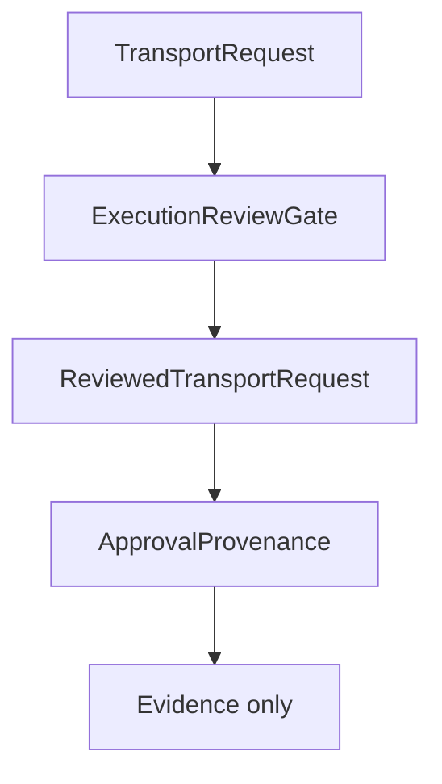

# Approval Provenance V11.4

`ApprovalProvenance` records descriptive evidence about a reviewed transport
request. It is not authorization and never permits execution.

It exists to make future approval and handoff discussions auditable without
introducing a handoff boundary in this lot.

## Purpose

Approval provenance records:

- the review identifier;
- the review timestamp;
- the review scope;
- the review status;
- the policy version;
- the configuration version;
- the mapping version;
- the protocol version;
- the runtime contract version;
- the transport contract version;
- the architecture RFC version.

The contract uses only abstract approval identifiers. It does not introduce
user accounts, authentication, authorization tokens, OAuth, certificates,
cryptographic signatures, or external identity providers.

## Lifecycle

`ApprovalProvenance` is created after `ReviewedTransportRequest`. The
provenance default state is:

- `reviewPending`;
- `notApproved`;
- `executionStarted: false`.

## Review evidence

The provenance object records immutable references to the reviewed request and
authorization configuration. It may record which policy, configuration,
mapping, protocol, runtime contract, transport contract, and RFC versions were
reviewed.

It does not copy provider payloads, transport payloads, command details, process
options, credentials, environment, or filesystem data.

## Relationship with ExecutionReviewGate

`ExecutionReviewGate` verifies a `TransportRequest` against an
`AuthorizationConfiguration` and produces a `ReviewedTransportRequest`.
`ApprovalProvenance` records evidence about that reviewed request. It does not
review the request again, does not widen the review result, and does not change
the reviewed request status.

## Relationship with future execution boundary

The V11 RFC defines execution as a future explicit Core-owned handoff to a
selected `TransportAdapter` after validated evidence and human approval.
Approval provenance remains before that boundary.

A future boundary MAY require provenance as evidence, but provenance MUST NOT
be treated as sufficient authority to execute.

## Why provenance never authorizes execution

Provenance describes what was reviewed. It does not prove that execution should
start. It does not contain a dispatch decision, executable plan, runtime
request, transport adapter request, command, binary path, or process
configuration.

Future execution work MUST introduce a separate reviewed decision boundary.
That boundary MUST NOT infer approval from the existence of provenance alone.

As of V11.5, `HandoffEligibility` can assess whether a
`ReviewedTransportRequest` and `ApprovalProvenance` are internally consistent.
This remains an assessment only: it does not authorize execution and does not
perform handoff. See `docs/architecture/handoff-eligibility.md`.

## Security guarantees

The module MUST remain:

- deterministic;
- immutable;
- reference-only;
- side-effect free;
- default-deny;
- disconnected from Runtime and Transport implementations.

The module MUST NOT access process APIs, filesystem APIs, network APIs,
credentials, environment variables, commands, arguments, executable paths, or
dispatch data.
