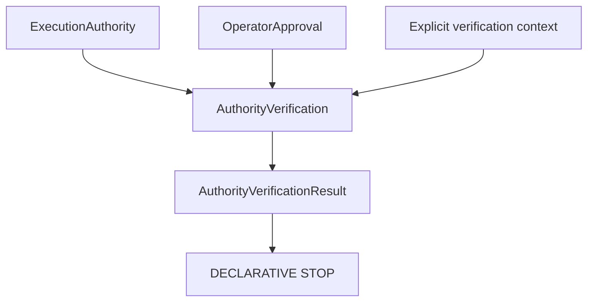
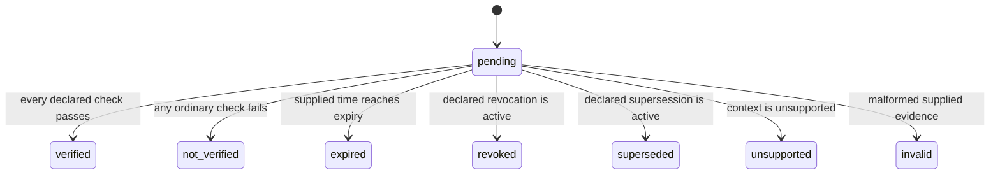

# Authority Verification RFC

## 1. Purpose

V13.2 defines **Authority Verification**: an independent, deterministic assessment of supplied `ExecutionAuthority`, Operator Approval, and explicit verification context. Approval is governance evidence. Verification is consistency assessment. Neither is an execution permit.

## 2. Architectural position

Verification has no edge to Dispatch, Boundary, Runtime, Transport, Provider, CLI, or LoopRunner.

## 3. Approval, verification, and authorization

Approval records a reviewed human governance decision. Verification assesses whether that record, authority, scope, versions, declared references, validity and evidence remain internally consistent. Authorization is a separate future authority concern. A verified result MUST NOT be considered authorization, dispatchability, executability, a boundary crossing, or execution permission.

## 4. Inputs, outputs, and verification subject

The pure builder consumes authority, approval, and an explicit context. The context supplies the verification timestamp and all future-facing references; it never reads a clock. The subject contains only declarative authority, approval, scope, provider, protocol, mapping, intent, runtime-capability, transport-capability, policy and evidence identifiers.

The output is immutable `AuthorityVerificationResult`, with explicit `verified`, individual verification flags, `executionAllowed: false`, and `executionStarted: false`.

## 5. Lifecycle

There are no operational states. `validFrom` is inclusive: a supplied verification time equal to it is valid. `expiresAt` is exclusive: a time equal to it is expired.

## 6. Complete check catalogue

The stable ordered checks are: authority presence, structural validity, active state, approval state; approval presence, lifecycle, review completeness and scope; authority and approval versions; provider, protocol, mapping, intent, runtime capability, transport capability and policy; evidence completeness; valid-from, expiry, revocation and supersession enforcement; and verification-context validity.

## 7. Structural validation and semantic evaluation

Structural validation rejects missing authority, approval, context and required context references. Semantic evaluation independently evaluates the ordered check catalogue from supplied values only. Invalid input is never normalized into a verified result. Diagnostics use stable codes and generic domain messages; they do not echo supplied identifiers or sensitive data.

## 8. Evidence, time, expiry, revocation, and supersession

Evidence consists only of declared identifiers, type, issuer/source references, supplied timestamps and safe notes. It contains no credentials, tokens, environment values, executable content or payloads. Revocation may be declared with timestamp and reason; inconsistent or active revocation fails closed. Supersession is a declared condition and fails closed. This RFC verifies supplied revocation data only; it does not author revocations or query a registry.

## 9. Default deny and security guarantees

Missing, unknown, incomplete, expired, revoked, superseded or unsupported evidence is not verified. Contracts, nested arrays, errors, diagnostics and summaries are deeply immutable. Builders are pure and deterministic: they use neither randomness nor an ambient clock, process, filesystem, network, environment, dynamic discovery or external lookup.

Verification MUST NOT create a Bridge, request, executable, command, argument, shell configuration, binary path, working directory, process configuration, operational payload or dispatch. It MUST NOT invoke Runtime, Transport or Provider.

## 10. Dependency rules and future integration

The module depends only on declarative authority and approval contract types. It is isolated from implementations and cannot form a dependency cycle with authority or approval. Future declarative layers MAY consume verification evidence, but a future RFC must separately define any authority-to-boundary bridge.

## 11. Explicit non-goals

This RFC introduces no Bridge, RuntimeRequest, TransportRequest, TransportAdapterRequest, dispatch, execution, provider invocation, runtime invocation, transport invocation, process API, filesystem access, network access, environment access, credential access, CLI change, JSON schema change or report schema change.
