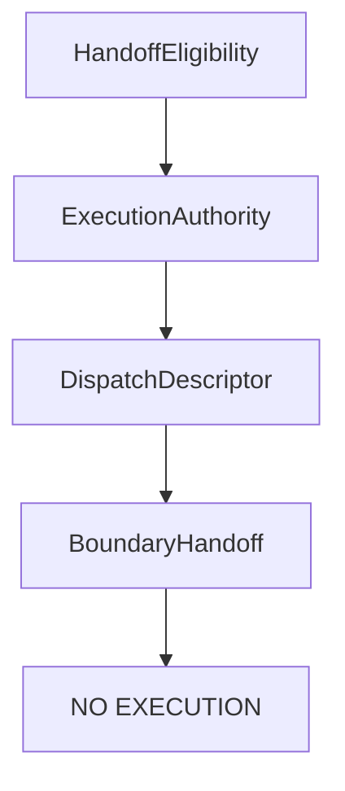
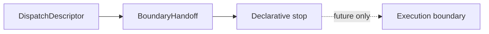

# Boundary Handoff

`BoundaryHandoff` is the V12.3 immutable declarative contract after
`DispatchDescriptor` and before any future execution boundary.

It does not perform a handoff. It does not create operational payloads. It
does not invoke Runtime, Transport, Provider, CLI, or LoopRunner code.

## Purpose

The contract exists to make the pre-boundary artifact explicit. It records
which descriptor, authority, eligibility, review, policy, configuration,
mapping, protocol, runtime contract, and transport contract evidence would be
reviewed before any future boundary crossing.

The object remains inert:

- `ready: false`;
- `accepted: false`;
- `dispatchable: false`;
- `executable: false`;
- `executionStarted: false`.

## Position in architecture

`BoundaryHandoff` is downstream of the dispatch descriptor but upstream of any
future execution boundary. There is no edge to an implementation in V12.3.

## Difference from DispatchDescriptor

`DispatchDescriptor` is the transport-independent descriptor built from
eligibility and authority evidence.

`BoundaryHandoff` is the immutable review object that wraps descriptor evidence
for the future boundary decision point. It is still not the boundary crossing.

## Static registry

The boundary registry is static, immutable, ordered, and deterministic. It
contains inert OpenClaw, Claude, and Codex fixtures. There is no discovery,
plugin loading, filesystem lookup, environment access, or reflection.

## Validation

Validation checks only declarative consistency:

- descriptor presence;
- descriptor validation state;
- descriptor evidence completeness;
- explicit eligibility consistency;
- explicit authority consistency;
- default denied handoff state.

Validation never executes and never dispatches.

## Future execution boundary

A future milestone may define how a validated boundary handoff is considered
by an execution boundary. V12.3 does not do that work.

No future implementation may treat `BoundaryHandoff` as execution authority by
itself. It is evidence only.

## Security guarantees

`BoundaryHandoff` contains no:

- commands;
- arguments;
- flags;
- binary paths;
- working directory;
- environment;
- credentials;
- process options;
- network endpoints;
- execution payloads;
- runtime payloads;
- transport payloads.

It also creates no runtime request, transport request, or adapter request.

## Default deny

Every produced result remains:

- `ready: false`;
- `accepted: false`;
- `dispatchable: false`;
- `executable: false`;
- `executionStarted: false`.

This preserves the V12 execution-boundary RFC: declarative evidence stops
before any future imperative operation.
