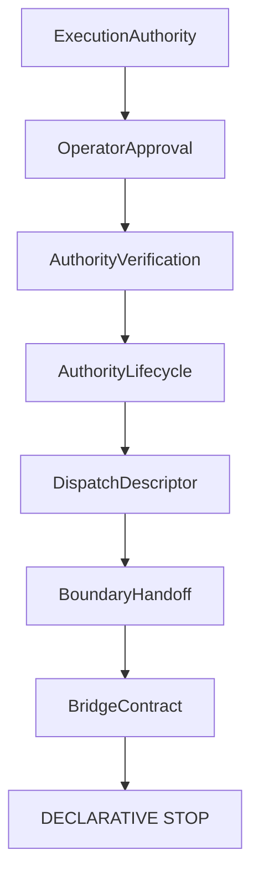

# Bridge Contract RFC

## Purpose, scope, and terminology

V13.4 defines an immutable, serializable Bridge Contract: a candidate declarative handoff after governance evidence has been assessed. It is not authorization, not execution, not runtime, not transport, not provider dispatch, and not side effects. It introduces no operational bridge.

## Contract structure and governance relationships

The contract references only identifiers and versions for authority, approval, verification, lifecycle, descriptor, handoff, provider, protocol, mapping, intent, runtime capability, transport capability and policy. Its context supplies supported bridge kinds and an expected policy. Evidence is a sorted collection of opaque identifiers.

## Validation, eligibility, and default deny

Validation is deterministic and rejects missing input, references, evidence, policy consistency, inactive lifecycle and unsupported bridge kinds. Evaluation time is explicit in the input; no ambient clock is read. A satisfied contract may be bridge eligible, but bridge eligibility alone is insufficient: `executionAllowed` remains false and `executionStarted` remains false.

## Security, serialization, extensions, and boundary

Objects are deeply frozen and JSON-serializable. There are no callbacks, clients, credentials, secrets, sockets, URLs with live behavior, subprocesses, filesystem access, network access, adapters, dispatch or execution primitives. Future extension points may add reviewed declarative fields only through a separate RFC. The operational boundary remains closed.

## Non-goals

This RFC does not introduce a RuntimeRequest, TransportRequest, TransportAdapterRequest, executable, command, provider request, runtime request, transport request, dispatch, execution or side effect.
