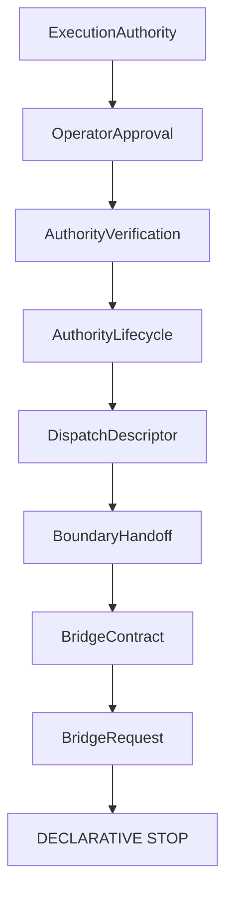

# Bridge Request RFC

## Purpose and boundary

V13.5 defines the immutable, serializable Bridge Request envelope derived from an explicitly eligible Bridge Contract. It is not authorization, not execution, not dispatch, not transport, not a provider request, and not a runtime request. It causes no side effects.

## Structure, references, and validation

The request uses caller-supplied identifier, version and timestamp, closed `bridge_handoff` kind, stable governance references, sorted evidence and inert serializable payload data. It requires an eligible source contract that still reports `executionAllowed: false` and `executionStarted: false`; lifecycle must be active. Contract eligibility alone and request constructibility alone do not authorize execution.

## Payload, security, and non-goals

Payload values are limited to inert strings, booleans, numbers and string arrays. Credential-like and operational fields are prohibited; no callbacks, handles, clients, secrets, commands, shell, process, filesystem, network, runtime, transport or provider surface exists. Diagnostics are deterministic and do not expose payload values. No ambient clock or identifier generation is used.

Bridge Request contains no credentials and no live clients or handles. It remains default-deny: `executionAllowed` remains false and `executionStarted` remains false. Future extensions require a separate reviewed RFC; the operational boundary remains closed.
