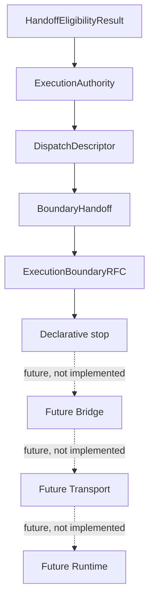
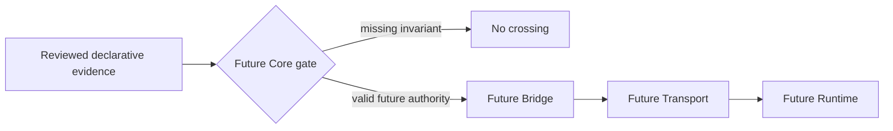
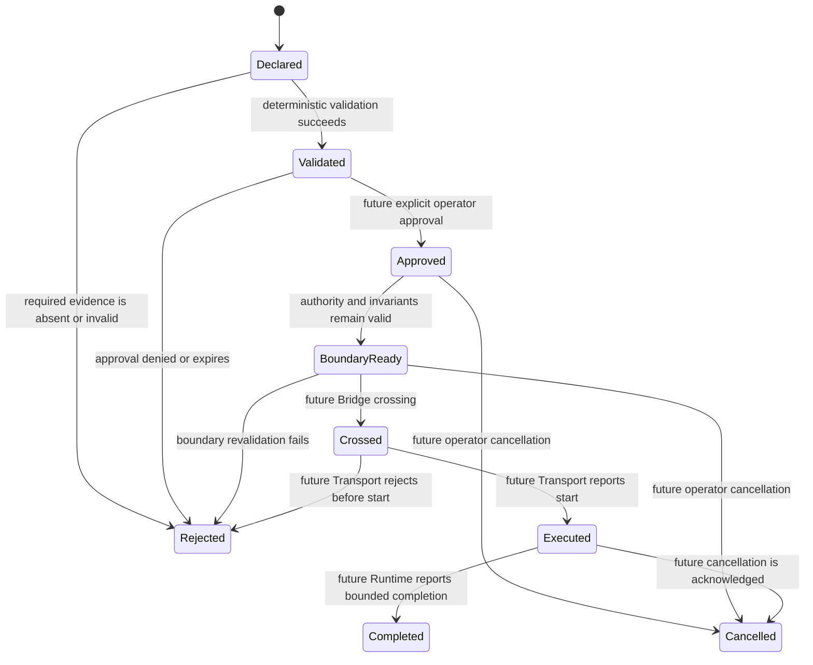
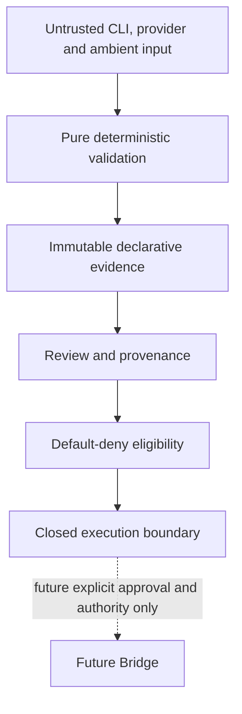

# Execution Architecture RFC

## Status and normative language

This RFC freezes the declarative execution architecture at V13.0. It is the
normative reference for future execution-boundary design. The words **MUST**,
**MUST NOT**, **SHOULD**, and **MAY** are normative.

This document records architecture; it does not add an execution capability.
The V12 execution-boundary RFC remains normative for the future crossing
semantics. Where the two documents differ, the V12 RFC takes precedence until
it is explicitly superseded by a reviewed RFC.

## 1. Architecture overview

The current pipeline is declarative. Each layer produces immutable evidence or
an assessment, then stops before any operational handoff.

- **Eligibility** assesses whether review and provenance evidence is internally
  consistent. It is not approval or authority.
- **ExecutionAuthority** represents a bounded future authority decision. It
  does not dispatch or execute.
- **DispatchDescriptor** describes the transport-independent material that a
  future boundary could examine. It is not a payload or instruction.
- **BoundaryHandoff** wraps a descriptor as declarative boundary evidence. It
  remains inactive and non-executable.
- **ExecutionBoundaryRFC** catalogues the invariants that must hold before a
  future crossing can be considered. It keeps the boundary closed.
- **Future Bridge** is the future Core-owned conversion point from reviewed
  declarative evidence to a transport-facing contract; it does not exist.
- **Future Transport** is the future imperative boundary owner; it does not
  exist in this architecture.
- **Future Runtime** is the future bounded backend reached only after a valid
  transport handoff; it does not exist in this architecture.

## 2. Responsibility matrix

| Layer | Owns | Does not own | Current state |
| --- | --- | --- | --- |
| Eligibility | Consistency assessment and requirement outcomes | Approval, authority, handoff | Implemented, declarative |
| Authority | Bounded future authority representation | Review, dispatch, execution | Implemented, declarative |
| Dispatch | Transport-independent descriptor | Transport selection, payload construction | Implemented, declarative |
| Boundary | Descriptor handoff evidence | Boundary crossing, dispatch | Implemented, declarative |
| Boundary RFC | Invariant catalogue and boundary evaluation | Operational permission, execution | Implemented, declarative |
| Future Bridge | One reviewed conversion into a future boundary contract | Provider interpretation, runtime execution | Future RFC |
| Future Runtime | Bounded work after a valid transport handoff | Authority creation, transport selection | Future implementation |
| Future Transport | Imperative handoff and start evidence | Policy interpretation, authority expansion | Future implementation |

## 3. Ownership

| Layer | Inputs | Outputs | Allowed dependencies | Forbidden dependencies |
| --- | --- | --- | --- | --- |
| Eligibility | `ReviewedTransportRequest`, `ApprovalProvenance` | `HandoffEligibilityResult` | Declarative review, provenance, policy, capability, mapping, intent, protocol, runtime and transport type contracts | CLI, LoopRunner, provider/runtime/transport implementations, process, filesystem, network |
| Authority | Eligibility evidence | `ExecutionAuthority` | Declarative eligibility and version references | Runtime and transport implementations, dispatch, process APIs |
| Dispatch | Eligibility result, authority | `DispatchDescriptor` | Declarative authority and eligibility contracts | Transport payloads, adapters, runtime, provider implementation |
| Boundary | Descriptor result | `BoundaryHandoffResult` | Declarative descriptor and contract references | Transport/runtime/provider implementation, dispatch, process APIs |
| Boundary RFC | Boundary handoff result | `ExecutionBoundaryResult` | Declarative boundary evidence and contract versions | Runtime/transport/provider implementation, requests, dispatch, process APIs |
| Future Bridge | Valid boundary result plus future explicit authority | A future transport-facing contract | Only reviewed declarative evidence and a future approved bridge contract | Raw CLI/provider input, implicit authority, ambient state |
| Future Transport | Future bridge contract | Start/non-start transport evidence | Selected future transport contract | Provider policy interpretation, authority mutation |
| Future Runtime | Valid future transport handoff | Bounded completion evidence | Selected future runtime contract | CLI arguments, approval records, eligibility assessment |

Ownership MUST remain single-purpose. A layer MUST NOT consume a downstream
implementation to prove that its own declarative result is valid.

## 4. Execution boundary

The execution boundary is not implemented. In future work, it begins only at
the explicit Core-owned Bridge after all declarative validation, explicit
operator approval, valid authority, valid descriptor, valid boundary evidence,
and audit preconditions have been verified.

Only bounded references, correlation identifiers, reviewed version references,
and future audited boundary metadata MAY cross. Raw CLI arguments, raw provider
payloads, inferred approval, inferred eligibility, ambient environment state,
credentials, commands, arguments, executable paths, and unbounded output MUST NOT cross.

The future Bridge owns the crossing. The Core MUST validate the crossing before
the Bridge is called; the future Transport MUST independently validate that the
incoming future contract is scoped to it. Neither a provider, runtime nor
transport MAY create, widen, or forge authority.

## 5. State machine

The state machine defines architecture states, not current executable
behaviour. `Crossed`, `Executed`, and `Completed` are future-only states.

- **Declared**: immutable declarative evidence exists; it grants nothing.
- **Validated**: deterministic validators confirm internal consistency.
- **Approved**: a future operator approval is explicit, scoped and recorded.
- **BoundaryReady**: all future crossing preconditions remain valid; it is not
  crossed, dispatchable, or executable in V13.0.
- **Crossed**: future-only evidence that the Bridge handed a valid future
  contract to Transport.
- **Executed**: future-only evidence that the selected Runtime began work.
- **Completed**: future-only normalized completion evidence.
- **Rejected**: a validation, policy, configuration, authority, or boundary
  condition failed closed.
- **Cancelled**: a future explicit cancellation ended the lifecycle without
  granting replacement authority.

No current implementation MAY transition to `Crossed`, `Executed`, or
`Completed`.

## 6. Invariant catalogue

The following V10–V12.4 invariants remain mandatory and are classified by
their owning layer.

| Layer | Invariants |
| --- | --- |
| Provider, mapping and intent | Static deterministic registries; validated protocol compatibility; mappings disabled by default; no executable metadata or provider execution |
| Policy and authorization | Default deny; explicit capability, policy and configuration references; no inferred authorization |
| Transport request and review | Immutable declarative requests; unique pure builder; deterministic review; review is not approval or dispatch |
| Provenance and eligibility | Provenance is evidence only; approval is never inferred; eligibility defaults to `not_eligible`; evidence must match versions and scope |
| Authority and dispatch descriptor | Authority is bounded; descriptor is transport-independent, immutable, non-dispatchable and non-executable |
| Boundary handoff | Handoff is declarative, inactive, unaccepted and default-denied; it creates no adapter/runtime/transport request |
| Boundary RFC | Authority, eligibility, descriptor, boundary, evidence, policy, review, configuration, transport-isolation and runtime-isolation invariants are evaluated deterministically; crossing remains denied |
| All declarative layers | No shell, process APIs, filesystem, network, credentials, environment access, Runtime interaction, Transport interaction, Provider invocation, dispatch or execution |

Invariant validation MUST be deterministic, stable, and safe to reproduce from
the same inputs. Missing, unknown, or inconsistent evidence MUST fail closed.

## 7. Threat model

| Threat | Required mitigation |
| --- | --- |
| Accidental execution | Default-deny flags and no imperative edge in the current graph |
| Privilege escalation | Single-purpose ownership; no layer may widen authority or infer approval |
| Runtime bypass | Runtime is absent from declarative dependencies and may only be reached through a future validated transport boundary |
| Transport bypass | Transport is absent from declarative dependencies and may only receive a future Bridge-created contract |
| Provider bypass | Providers cannot create authority, descriptors, boundary results, or future bridge contracts |
| Descriptor forgery | Immutable descriptor evidence, deterministic reference/version checks, and future Core revalidation |
| Authority forgery | Explicit, scoped future authority; no authority inferred from review, provenance, eligibility, or configuration |
| Boundary forgery | Boundary handoff and RFC invariant verification remain declarative and default-denied |
| Review bypass | Eligibility requires consistent reviewed request and provenance evidence; future Bridge requires explicit operator approval |

Threat mitigations MUST be verified at the owning layer and MUST NOT depend on
successful execution as proof.

## 8. Security model

The architecture is default-deny. Immutable contracts prevent callers from
mutating validated evidence after construction. Pure builders and evaluators
make validation reproducible. Deterministic validation records stable outcomes
instead of reading machine, process, filesystem, network, or environment state.

Review is mandatory evidence, not an execution permit. Approval, where future
work introduces it, MUST be explicit, scoped, versioned, reviewable and
revocable. Auditability requires a stable record of validation inputs,
requirements, errors, version references and the future distinction between
non-start and start; it MUST NOT require secret or credential disclosure.

## 9. Operational roadmap

| Status | Scope |
| --- | --- |
| Already implemented | Declarative provider protocol, mapping, intent, capability/policy, authorization, transport request, review, provenance, eligibility, authority, descriptor, boundary handoff and boundary RFC evidence |
| Future RFC | Operator approval semantics, execution authority lifecycle, Bridge contract, transport-facing contract, cancellation, recovery, observability and execution audit semantics |
| Future implementation | A reviewed Core-owned Bridge; selected Transport; selected Runtime; bounded execution evidence; cancellation and recovery mechanisms |

Future implementation MUST follow a dedicated RFC and security/architecture
review. It MUST preserve existing CLI, JSON, report, schema and LoopRunner
contracts unless separately versioned.

## 10. Explicit non-goals

This RFC does not introduce:

- `RuntimeRequest`;
- `TransportRequest`;
- execution;
- a Bridge;
- adapter payloads;
- provider invocation;
- transport invocation;
- runtime invocation;
- commands, arguments, binaries, shells or process APIs;
- filesystem, network, credential, or environment access.

V13.0 therefore leaves the pipeline at a declarative stop. A future eligible,
validated, approved, or boundary-ready state is never an execution capability
until a separately reviewed future implementation crosses the boundary.
