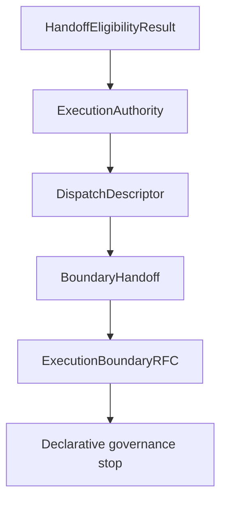
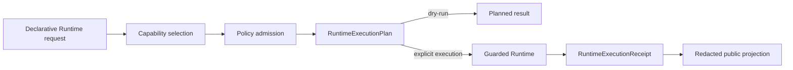
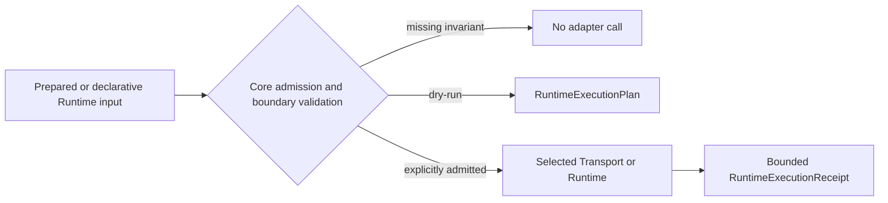
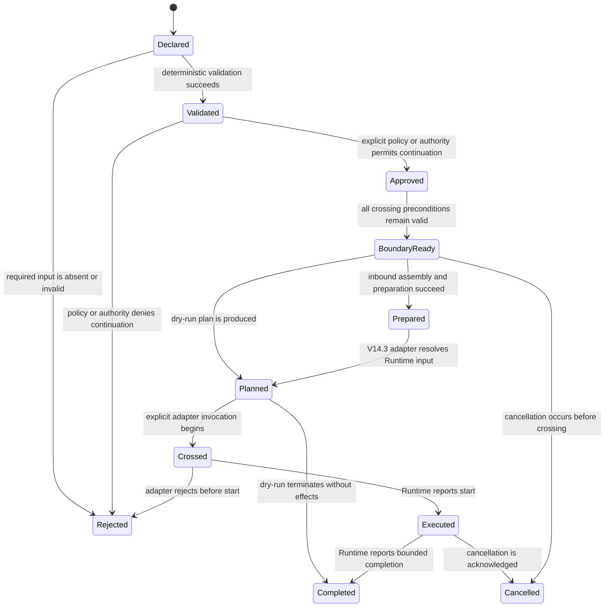
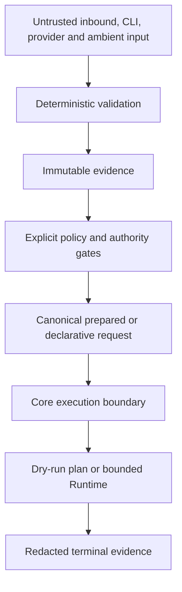

# Execution Architecture RFC

## Status and normative language

This RFC describes the execution architecture implemented through V14.2u and the
remaining boundary required by V14.3. It supersedes the V13.0 document's
current-state claims while preserving the default-deny and ownership guarantees
established by the V12 execution-boundary RFC.

The words **MUST**, **MUST NOT**, **SHOULD**, and **MAY** are normative. This
document records architecture; it does not itself enable a new execution path,
provider, transport adapter, CLI mode, or permission.

## 1. Architecture overview

Loop Engine currently contains three related but not yet fully connected flows.

### 1.1 Declarative governance flow

```mermaid
flowchart TD
  Eligibility["HandoffEligibilityResult"] --> Authority["ExecutionAuthority"]
  Authority --> Descriptor["DispatchDescriptor"]
  Descriptor --> Handoff["BoundaryHandoff"]
  Handoff --> BoundaryRFC["ExecutionBoundaryRFC"]
  BoundaryRFC --> DeclarativeStop["Declarative governance stop"]
```

- **Eligibility** checks reviewed evidence and provenance consistency.
- **ExecutionAuthority** represents bounded authority evidence; it does not
  execute work.
- **DispatchDescriptor** describes transport-independent dispatch evidence.
- **BoundaryHandoff** carries immutable boundary evidence.
- **ExecutionBoundaryRFC** evaluates boundary invariants deterministically.

These layers remain declarative and MUST NOT invoke Runtime, Transport, Provider,
process, filesystem, network, credential, or ambient environment APIs.

### 1.2 Opt-in Runtime execution flow

```mermaid
flowchart LR
  DeclarativeRequest["Declarative Runtime request"] --> Selection["Capability selection"]
  Selection --> Admission["Policy admission"]
  Admission --> Plan["RuntimeExecutionPlan"]
  Plan -->|dry-run| Planned["Planned result"]
  Plan -->|explicit execution| Runtime["Guarded Runtime"]
  Runtime --> Receipt["RuntimeExecutionReceipt"]
  Receipt --> PublicProjection["Redacted public projection"]
```

Core already owns an explicit execution bridge. It can resolve a declarative
request, enforce policy admission, produce a dry-run plan, execute the simulated
Runtime, and execute local-process only through an explicit policy-bound binding.
Transport and Runtime implementations exist, remain opt-in, and are absent from
the public CLI and `LoopRunner`.

### 1.3 Inbound preparation flow

```mermaid
flowchart LR
  Envelope["Inbound envelope"] --> Validate["Envelope validation"]
  Validate --> Authentication["Injected authentication verification"]
  Authentication --> Replay["Injected replay protection"]
  Replay --> Security["Inbound security policy"]
  Security --> Authorization["Public-request authorization"]
  Authorization --> Assembly["Engine assembly"]
  Assembly --> Preparation["LoopRuntimeConstructedRuntimeRequest"]
  Preparation --> Gap["V14.3 integration gap"]
```

The inbound application handler is transport-neutral and composes validation,
authentication, replay, security, authorization, assembly, and preparation. It
currently stops with a prepared declarative Runtime request. No production
adapter currently connects that prepared request to the opt-in Runtime execution
flow.

The V13.0 labels **Future Bridge**, **Future Runtime**, and **Future Transport**
are retained only as historical terminology. The corresponding implementation
families now exist; the missing capability is their composed use from the inbound
prepared-request boundary.

## 2. Responsibility matrix

| Layer | Owns | Does not own | Current state |
| --- | --- | --- | --- |
| Eligibility | Consistency assessment and requirement outcomes | Approval, authority creation, execution | Implemented, declarative |
| Authority | Bounded authority evidence | Review, dispatch, execution | Implemented, declarative |
| DispatchDescriptor | Transport-independent evidence | Adapter payload construction, execution | Implemented, declarative |
| BoundaryHandoff | Immutable boundary evidence | Runtime or Transport invocation | Implemented, declarative |
| ExecutionBoundaryRFC | Deterministic invariant evaluation | Operational permission or execution | Implemented, declarative |
| Inbound handler | Envelope validation and ordered security composition | Protocol-specific I/O, identity storage, Runtime execution | Implemented through preparation |
| Core execution bridge | Capability selection, policy admission, plan, explicit Runtime invocation, receipt | Identity proof, ACL invention, ambient authority | Implemented, opt-in |
| Transport | Bounded imperative delegation to an allowed Runtime | Policy interpretation, authority expansion | Implemented, opt-in |
| Runtime | Bounded work and normalized result | Approval, transport selection, authority creation | Implemented, guarded |
| LoopRunner | Planning, policy forecast and context package | Runtime execution, repair, commit, publication | Implemented, plan-only |

## 3. Ownership

| Layer | Inputs | Outputs | Allowed dependencies | Forbidden dependencies |
| --- | --- | --- | --- | --- |
| Eligibility | `ReviewedTransportRequest`, `ApprovalProvenance` | `HandoffEligibilityResult` | Declarative review, provenance, policy and reference contracts | CLI, LoopRunner, Provider/Transport/Runtime implementations, process, filesystem, network |
| Authority | Eligibility evidence | `ExecutionAuthority` | Declarative eligibility and version references | Runtime and Transport implementations, process APIs |
| DispatchDescriptor | Eligibility result and authority | Descriptor result | Declarative authority and eligibility contracts | Adapter payloads, Runtime and Transport implementations |
| BoundaryHandoff | Descriptor result | Boundary result | Declarative descriptor and contract references | Runtime, Transport, Provider and process APIs |
| ExecutionBoundaryRFC | Boundary result | Invariant result | Declarative evidence and version references | Runtime, Transport, Provider and dispatch APIs |
| Inbound handler | Untrusted envelope plus injected ports | Rejected result or prepared request | Inbound security and public-request Core contracts | HTTP frameworks, secret discovery, Runtime execution |
| Core execution bridge | Declarative Runtime input, explicit registry/mapping/policy/binding | Plan, Runtime result, receipt and redacted projection | Core Runtime contracts and explicitly injected authority | Raw transport input, implicit approval, ambient credentials |
| Transport | Validated adapter request and explicit policy | Start/non-start and normalized transport evidence | Selected guarded Runtime contract | Provider policy interpretation, authority mutation |
| Runtime | Canonical Runtime request and explicit limits | Bounded completion evidence | Runtime-local contracts and approved effect boundary | CLI arguments, approval records, implicit transport selection |

Ownership MUST remain single-purpose. A layer MUST NOT consume a downstream
implementation to prove that its own declarative result is valid.

## 4. Execution boundary

The execution boundary is implemented only in explicit Core-owned Runtime paths.
It is not yet connected to the inbound prepared-request path or to `LoopRunner`.

Only canonical requests, bounded policy decisions, explicit Runtime mappings,
correlation identifiers, validated limits, and redacted evidence MAY cross an
operational boundary. Raw inbound payloads, inferred approval, inferred
eligibility, ambient environment state, credentials, unreviewed commands,
unbounded output, and mutable policy objects MUST NOT cross.

Core MUST validate the crossing before a Transport or Runtime adapter is invoked.
Transport MUST independently validate that the request is scoped to it. Neither
Provider, Transport nor Runtime MAY create, widen, or forge authority.

The V13.0 sentence "the future Bridge owns the crossing" is superseded by the
current rule: the Core execution bridge owns the crossing, while the V14.3
application service will own composition from prepared inbound request to that
bridge.

```mermaid
flowchart LR
  Prepared["Prepared or declarative Runtime input"] --> CoreGate{"Core admission and boundary validation"}
  CoreGate -- "missing invariant" --> Deny["No adapter call"]
  CoreGate -- "dry-run" --> Plan["RuntimeExecutionPlan"]
  CoreGate -- "explicitly admitted" --> Transport["Selected Transport or Runtime"]
  Transport --> Receipt["Bounded RuntimeExecutionReceipt"]
```

## 5. State machine

The architecture uses the following lifecycle vocabulary. Not every entrypoint
currently traverses every state.

```mermaid
stateDiagram-v2
  [*] --> Declared
  Declared --> Validated: deterministic validation succeeds
  Declared --> Rejected: required input is absent or invalid
  Validated --> Approved: explicit policy or authority permits continuation
  Validated --> Rejected: policy or authority denies continuation
  Approved --> BoundaryReady: all crossing preconditions remain valid
  BoundaryReady --> Prepared: inbound assembly and preparation succeed
  BoundaryReady --> Planned: dry-run plan is produced
  Prepared --> Planned: V14.3 adapter resolves Runtime input
  Planned --> Crossed: explicit adapter invocation begins
  Planned --> Completed: dry-run terminates without effects
  Crossed --> Executed: Runtime reports start
  Crossed --> Rejected: adapter rejects before start
  Executed --> Completed: Runtime reports bounded completion
  Executed --> Cancelled: cancellation is acknowledged
  BoundaryReady --> Cancelled: cancellation occurs before crossing
```

- **Declared**: immutable input or evidence exists; it grants nothing.
- **Validated**: deterministic validators confirm structural consistency.
- **Approved**: explicit policy or authority allows the next bounded step.
- **BoundaryReady**: all crossing preconditions are valid at evaluation time.
- **Prepared**: the inbound public request has been assembled and converted into
  `LoopRuntimeConstructedRuntimeRequest`; current inbound execution stops here.
- **Planned**: a serializable `RuntimeExecutionPlan` exists; dry-run may finish
  without any adapter call.
- **Crossed**: Core invoked the selected operational boundary.
- **Executed**: the selected Runtime reports that bounded work started.
- **Completed**: dry-run or Runtime completion has stable terminal evidence.
- **Rejected**: validation, policy, configuration, authority, preparation, or
  adapter admission failed closed.
- **Cancelled**: explicit cancellation ended the lifecycle without creating new
  authority.

`LoopRunner` currently reaches planning completion only. The inbound handler
currently reaches `Prepared` only. The opt-in Runtime bridge can reach `Planned`,
`Crossed`, `Executed`, and `Completed` independently.

## 6. Invariant catalogue

The following invariants remain mandatory and are classified by owning layer.

| Layer | Invariants |
| --- | --- |
| Provider, mapping and intent | Static deterministic registries; validated protocol compatibility; mappings disabled by default; no authority creation |
| Policy and authorization | Default deny; explicit capability, policy and configuration references; restrictive merge; no inferred authorization |
| Transport request and review | Immutable declarative requests; deterministic review; review is not approval or dispatch |
| Provenance and eligibility | Provenance is evidence only; approval is never inferred; evidence matches versions and scope |
| Authority and DispatchDescriptor | Authority is bounded; descriptor is transport-independent and immutable |
| BoundaryHandoff | Handoff is declarative and default-denied; it creates no adapter or Runtime request |
| Boundary RFC | Authority, eligibility, descriptor, evidence, policy, review, configuration, transport isolation and runtime isolation are evaluated deterministically |
| Inbound security | Envelope, identity, time, tenant, operation, project, method, hints, replay evidence and nonce bindings are checked before downstream preparation |
| Core execution bridge | Capability selection and policy admission precede Runtime invocation; dry-run performs no effect; local-process requires an explicit binding |
| Transport and Runtime | Shell remains disabled; executables and working directories are bounded; output and duration limits are enforced; results are normalized and redacted |
| All public boundaries | Fail closed; invoke dependencies at most once; expose stable reasons; do not leak credentials, stack traces, raw commands or unbounded output |

Invariant validation MUST be deterministic, stable, and safe to reproduce from
the same explicit inputs. Missing, unknown, stale, or inconsistent evidence MUST
fail closed.

## 7. Threat model

| Threat | Required mitigation |
| --- | --- |
| Accidental execution | Dry-run is first-class; operational adapters require explicit admission and bindings |
| Privilege escalation | Single-purpose ownership; no layer may widen authority or infer approval |
| Runtime bypass | Only Core may reach Runtime after capability resolution and policy admission |
| Transport bypass | Adapter invocation occurs only through the Core-owned boundary |
| Provider bypass | Providers cannot create authority, policy admission, descriptors or Runtime bindings |
| Descriptor forgery | Immutable descriptor evidence and deterministic reference/version checks |
| Authority forgery | Explicit scoped authority; no authority inferred from review, provenance or eligibility |
| Boundary forgery | Boundary and admission checks fail closed and are repeated at their owning boundary |
| Review bypass | Reviewed evidence and explicit policy remain separate requirements |
| Inbound identity confusion | Request, tenant, project, operation, time and replay evidence remain bound across stages |
| Replay | Local replay checks precede the injected replay port; a concrete durable store remains future work |
| Data leakage | Public plans, receipts and failures are redacted and JSON-safe |

Threat mitigations MUST be verified at the owning layer and MUST NOT depend on
successful execution as proof.

## 8. Security model

The architecture is default-deny. Immutable contracts prevent callers from
mutating validated evidence after construction. Pure builders and evaluators
make validation reproducible. Operational effects are isolated behind explicit
Core-owned calls and explicit injected dependencies.

Authentication verification, replay evaluation, authorization, assembly, policy
admission, Transport selection, and Runtime execution are distinct decisions.
Success at one stage MUST NOT imply success at another. Every failure before an
operational boundary MUST produce zero Runtime calls.

Review is evidence, not an execution permit. Approval and policy admission MUST
be explicit, scoped, versioned, reviewable, revocable where applicable, and
revalidated before crossing. Auditability requires stable validation outcomes,
correlation references, plan/receipt evidence and a start/non-start distinction;
it MUST NOT require credential, raw command, stack, or unbounded-output
disclosure.

```mermaid
flowchart TB
  Untrusted["Untrusted inbound, CLI, provider and ambient input"] --> Validate["Deterministic validation"]
  Validate --> Evidence["Immutable evidence"]
  Evidence --> Policy["Explicit policy and authority gates"]
  Policy --> Prepare["Canonical prepared or declarative request"]
  Prepare --> CoreBoundary["Core execution boundary"]
  CoreBoundary --> PlanOrRun["Dry-run plan or bounded Runtime"]
  PlanOrRun --> Redacted["Redacted terminal evidence"]
```

## 9. Operational roadmap

| Status | Scope |
| --- | --- |
| Already implemented | Declarative governance layers; guarded Runtime; deterministic Runtime selection; policy admission; dry-run plans; simulated execution; policy-bound local-process execution; receipts and public projections; inbound validation/authentication/replay/security/authorization/assembly/preparation |
| Current gap | No production adapter joins `LoopRuntimeConstructedRuntimeRequest` from the inbound path to the existing policy-aware Runtime execution bridge |
| V14.3 | Deliver one Core application service for prepared inbound request -> Runtime plan/receipt, including dry-run and simulated execution proof |
| Future RFC | Durable cancellation, recovery, journal/resume semantics, concrete identity and replay persistence, and controlled LoopRunner execution lifecycle |
| Future implementation | `LoopRunner` execute/validate/repair, one concrete inbound adapter, one concrete identity/ACL/replay stack, one real provider pilot, then controlled commit mode |

A network adapter or real Provider invocation MUST NOT precede V14.3. Future
implementation MUST preserve public CLI, JSON, report and schema contracts unless
separately versioned.

## 10. Explicit non-goals

This alignment lot does not introduce:

- the V14.3 prepared-request adapter;
- a new Runtime, Transport, Provider, server, route, socket, queue, or webhook;
- real Claude Code, Codex, or OpenClaw invocation;
- credential or environment discovery;
- concrete authentication, ACL, replay storage, or tenant registry;
- `LoopRunner` execute, repair, commit, publish, or resume;
- new operational permissions;
- a breaking public API or JSON schema change.

### Historical V13.0 non-goals (superseded as current-state claims)

The original RFC explicitly excluded:

- `RuntimeRequest`;
- `TransportRequest`;
- execution;
- a Bridge;
- adapter payloads;
- provider invocation;
- transport invocation;
- runtime invocation;
- commands, arguments, binaries, shells, process, filesystem, network,
  credential, and environment access.

Those labels remain here for historical traceability and compatibility with the
V13.0 audit inventory. Runtime, Transport, Bridge, `RuntimeRequest`, and bounded
execution families now exist as opt-in Core capabilities. The current missing
boundary is the V14.3 composition from prepared inbound request to the existing
Runtime plan/receipt path.
