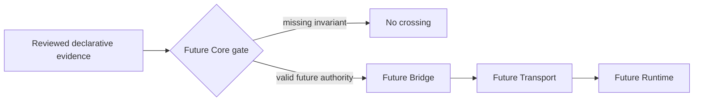
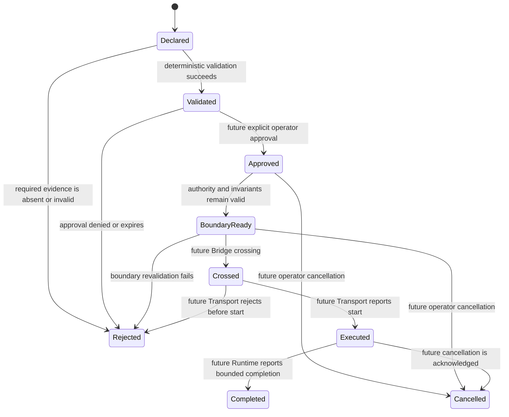
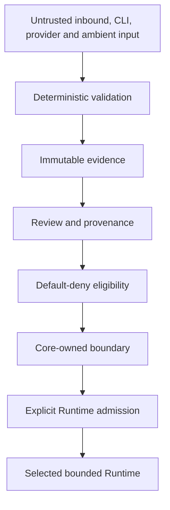

# Execution Architecture RFC

## Status and normative language

This RFC freezes the **historical V13.0 declarative baseline**. It remains the
normative reference for the responsibilities and invariants of those V13.0
layers, but it is no longer a current-state inventory of the repository. The
words **MUST**, **MUST NOT**, **SHOULD**, and **MAY** are normative within that
historical scope.

The current operational composition is documented by
`prepared-inbound-runtime-execution.md` and `runtime-abstraction.md`. The V12
execution-boundary RFC remains normative for crossing semantics unless a later
reviewed contract explicitly supersedes it.

## Current implementation status — V14.3

The repository now contains guarded Runtime and Transport implementations,
Core-owned Runtime admission, execution plans and receipts, a transport-neutral
inbound handler, and the V14.3 application service
`executePreparedInboundRuntimeRequest(...)`.

The current supported vertical slice is:

```text
inbound envelope
-> validation/authentication/replay/security
-> decode/authorize/assemble/prepare
-> trusted execution-context resolution
-> Runtime admission and resolution
-> dry-run plan OR one bounded Runtime invocation
-> redacted receipt
```

This does **not** make the historical declarative governance graph executable.
Eligibility, authority, review, provenance, descriptor and boundary evidence
still cannot create or widen operational authority. Authentication, ACL, replay
persistence, inbound transport, provider execution and LoopRunner execute mode
remain separate future deliveries. References to “Future Bridge”, “Future
Transport” and “Future Runtime” in sections 1–10 below describe the frozen
V13.0 baseline, not the repository state after V14.3.

## 1. Architecture overview

At V13.0 the pipeline was declarative. Each layer produced immutable evidence
or an assessment, then stopped before any operational handoff.

```mermaid
flowchart TD
  Eligibility["HandoffEligibilityResult"] --> Authority["ExecutionAuthority"]
  Authority --> Descriptor["DispatchDescriptor"]
  Descriptor --> Handoff["BoundaryHandoff"]
  Handoff --> BoundaryRFC["ExecutionBoundaryRFC"]
  BoundaryRFC --> Stop["Declarative stop"]

  Stop -. future, not implemented at V13.0 .-> Bridge["Future Bridge"]
  Bridge -. future, not implemented at V13.0 .-> Transport["Future Transport"]
  Transport -. future, not implemented at V13.0 .-> Runtime["Future Runtime"]
```

- **Eligibility** assesses whether review and provenance evidence is internally
  consistent. It is not approval or authority.
- **ExecutionAuthority** represents a bounded future authority decision. It
  does not dispatch or execute.
- **DispatchDescriptor** describes the transport-independent material that a
  future boundary could examine. It is not a payload or instruction.
- **BoundaryHandoff** wraps a descriptor as declarative boundary evidence. It
  remains inactive and non-executable.
- **ExecutionBoundaryRFC** catalogues the invariants that must hold before a
  future crossing can be considered. It keeps the boundary closed.
- **Future Bridge** was the V13.0 name for a future Core-owned conversion point
  from reviewed declarative evidence to a transport-facing contract.
- **Future Transport** was the V13.0 future imperative boundary owner.
- **Future Runtime** was the V13.0 future bounded backend.

## 2. Responsibility matrix

| Layer | Owns | Does not own | V13.0 state |
| --- | --- | --- | --- |
| Eligibility | Consistency assessment and requirement outcomes | Approval, authority, handoff | Implemented, declarative |
| Authority | Bounded future authority representation | Review, dispatch, execution | Implemented, declarative |
| Dispatch | Transport-independent descriptor | Transport selection, payload construction | Implemented, declarative |
| Boundary | Descriptor handoff evidence | Boundary crossing, dispatch | Implemented, declarative |
| Boundary RFC | Invariant catalogue and boundary evaluation | Operational permission, execution | Implemented, declarative |
| Future Bridge | One reviewed conversion into a future boundary contract | Provider interpretation, runtime execution | Future RFC at V13.0 |
| Future Runtime | Bounded work after a valid transport handoff | Authority creation, transport selection | Future implementation at V13.0 |
| Future Transport | Imperative handoff and start evidence | Policy interpretation, authority expansion | Future implementation at V13.0 |

## 3. Ownership

| Layer | Inputs | Outputs | Allowed dependencies | Forbidden dependencies |
| --- | --- | --- | --- | --- |
| Eligibility | `ReviewedTransportRequest`, `ApprovalProvenance` | `HandoffEligibilityResult` | Declarative review, provenance, policy, capability, mapping, intent, protocol, runtime and transport type contracts | CLI, LoopRunner, provider/runtime/transport implementations, process, filesystem, network |
| Authority | Eligibility evidence | `ExecutionAuthority` | Declarative eligibility and version references | Runtime and transport implementations, dispatch, process APIs |
| Dispatch | Eligibility result, authority | `DispatchDescriptor` | Declarative authority and eligibility contracts | Transport payloads, adapters, runtime, provider implementation |
| Boundary | Descriptor result | `BoundaryHandoffResult` | Declarative descriptor and contract references | Transport/runtime/provider implementation, dispatch, process APIs |
| Boundary RFC | Boundary handoff result | `ExecutionBoundaryResult` | Declarative boundary evidence and contract versions | Runtime/transport/provider implementation, requests, dispatch, process APIs |
| Future Bridge | Valid boundary result plus future explicit authority | A future transport-facing contract | Only reviewed declarative evidence and a future approved bridge contract | Raw CLI/provider input, implicit authority, ambient state |
| Future Transport | Future bridge contract | Start/non-start transport evidence | Selected future transport contract | Provider policy interpretation, authority mutation |
| Future Runtime | Valid future transport handoff | Bounded completion evidence | Selected future runtime contract | CLI arguments, approval records, eligibility assessment |

Ownership MUST remain single-purpose. A layer MUST NOT consume a downstream
implementation to prove that its own declarative result is valid.

## 4. Execution boundary

At V13.0 the execution boundary was not implemented. The historical design
required it to begin only at the explicit Core-owned Bridge after declarative
validation, explicit operator approval, valid authority, valid descriptor,
valid boundary evidence, and audit preconditions.

Only bounded references, correlation identifiers, reviewed version references,
and audited boundary metadata MAY cross. Raw CLI arguments, raw provider
payloads, inferred approval, inferred eligibility, ambient environment state,
credentials, commands, arguments, executable paths, and unbounded output MUST NOT cross.

In the historical model, the future Bridge owns the crossing. The Core MUST
validate the crossing before the Bridge is called; the future Transport MUST
independently validate that the incoming contract is scoped to it. Neither a
provider, runtime nor transport MAY create, widen, or forge authority. V14.3
preserves that rule by accepting only trusted injected context and by applying
Runtime admission before resolution or invocation.


```mermaid
flowchart LR
  Evidence["Reviewed declarative evidence"] --> CoreGate{"Future Core gate"}
  CoreGate -- "missing invariant" --> Deny["No crossing"]
  CoreGate -- "valid future authority" --> Bridge["Future Bridge"]
  Bridge --> Transport["Future Transport"]
  Transport --> Runtime["Future Runtime"]
```

## 5. State machine

The state machine below defines the V13.0 architecture states. `Crossed`,
`Executed`, and `Completed` were future-only states in that baseline. V14.3
uses a separate application result (`planned`, `executed`, `rejected`,
`failed`) and does not mutate this governance state machine.


```mermaid
stateDiagram-v2
  [*] --> Declared
  Declared --> Validated: deterministic validation succeeds
  Declared --> Rejected: required evidence is absent or invalid
  Validated --> Approved: future explicit operator approval
  Validated --> Rejected: approval denied or expires
  Approved --> BoundaryReady: authority and invariants remain valid
  Approved --> Cancelled: future operator cancellation
  BoundaryReady --> Crossed: future Bridge crossing
  BoundaryReady --> Rejected: boundary revalidation fails
  BoundaryReady --> Cancelled: future operator cancellation
  Crossed --> Executed: future Transport reports start
  Crossed --> Rejected: future Transport rejects before start
  Executed --> Completed: future Runtime reports bounded completion
  Executed --> Cancelled: future cancellation is acknowledged
```

- **Declared**: immutable declarative evidence exists; it grants nothing.
- **Validated**: deterministic validators confirm internal consistency.
- **Approved**: a future operator approval is explicit, scoped and recorded.
- **BoundaryReady**: all crossing preconditions remain valid.
- **Crossed**: evidence that a reviewed boundary contract was handed off.
- **Executed**: evidence that the selected Runtime began work.
- **Completed**: normalized completion evidence.
- **Rejected**: a validation, policy, configuration, authority, or boundary
  condition failed closed.
- **Cancelled**: explicit cancellation ended the lifecycle without granting
  replacement authority.

No V13.0 declarative result alone MAY transition to `Crossed`, `Executed`, or
`Completed`. V14.3 requires a separate inbound decision, trusted execution
context, policy admission and Runtime resolution.

## 6. Invariant catalogue

The following V10–V12.4 invariants remain mandatory and are classified by
their owning layer.

| Layer | Invariants |
| --- | --- |
| Provider, mapping and intent | Static deterministic registries; validated protocol compatibility; mappings disabled by default; no executable metadata or provider execution |
| Policy and authorization | Default deny; explicit capability, policy and configuration references; no inferred authorization |
| Transport request and review | Immutable declarative requests; unique pure builder; deterministic review; review is not approval or dispatch |
| Provenance and eligibility | Provenance is evidence only; approval is never inferred; eligibility defaults to `not_eligible`; evidence must match versions and scope |
| Authority and dispatch descriptor | Authority is bounded; descriptor is transport-independent, immutable, non-dispatchable and non-executable |
| Boundary handoff | Handoff is declarative, inactive, unaccepted and default-denied; it creates no adapter/runtime/transport request |
| Boundary RFC | Authority, eligibility, descriptor, boundary, evidence, policy, review, configuration, transport-isolation and runtime-isolation invariants are evaluated deterministically |
| Operational V14.3 boundary | Inbound gates are reused; trusted context is injected; Runtime admission precedes resolution; dry-run does not invoke; execute invokes once; public output is redacted |

Invariant validation MUST be deterministic, stable, and safe to reproduce from
the same inputs. Missing, unknown, or inconsistent evidence MUST fail closed.

## 7. Threat model

| Threat | Required mitigation |
| --- | --- |
| Accidental execution | Default deny, explicit execute mode, Runtime admission and dry-run return before invocation |
| Privilege escalation | Single-purpose ownership; no layer may widen authority or infer approval |
| Runtime bypass | Runtime is reached only through the V14.3 Core application service or another separately audited Core boundary |
| Transport bypass | Transport adapters cannot receive raw inbound or governance payloads |
| Provider bypass | Providers cannot create authority, descriptors, boundary results, or execution context |
| Descriptor forgery | Immutable descriptor evidence, deterministic reference/version checks, and Core revalidation |
| Authority forgery | Explicit scoped authority; no authority inferred from review, provenance, eligibility, configuration or payload |
| Boundary forgery | Boundary handoff and RFC invariant verification remain declarative and default-denied |
| Review bypass | Eligibility requires consistent reviewed request and provenance evidence; operational boundaries require their own explicit admission |

Threat mitigations MUST be verified at the owning layer and MUST NOT depend on
successful execution as proof.

## 8. Security model

The architecture is default-deny. Immutable contracts prevent callers from
mutating validated evidence after construction. Pure builders and evaluators
make validation reproducible. Operational dependencies are injected rather
than discovered from ambient machine, process, network or environment state.

Review is mandatory evidence, not an execution permit. Approval MUST be
explicit, scoped, versioned, reviewable and revocable. Auditability requires a
stable record of validation inputs, requirements, errors, version references
and the distinction between non-start and start; it MUST NOT require secret or
credential disclosure.


```mermaid
flowchart TB
  Untrusted["Untrusted inbound, CLI, provider and ambient input"] --> Validate["Deterministic validation"]
  Validate --> Evidence["Immutable evidence"]
  Evidence --> Review["Review and provenance"]
  Review --> Eligibility["Default-deny eligibility"]
  Eligibility --> Boundary["Core-owned boundary"]
  Boundary --> Admission["Explicit Runtime admission"]
  Admission --> Runtime["Selected bounded Runtime"]
```

## 9. Operational roadmap

| Status | Scope |
| --- | --- |
| Already implemented | Declarative governance layers; guarded Runtime/Transport; Core Runtime admission, plans and receipts; inbound neutral handler; V14.3 prepared-inbound Runtime vertical slice |
| Future RFC | Durable cancellation, recovery, persistence, resume, operational identity/ACL and provider credential boundaries |
| Future implementation | LoopRunner execute/validate/repair; concrete identity/ACL/replay; one inbound adapter; one verified provider pilot; controlled commit mode |

Future implementation MUST follow dedicated security/architecture review and
preserve existing CLI, JSON, report, schema and LoopRunner contracts unless
separately versioned.

## 10. Explicit non-goals

The V13.0 baseline did not introduce:

- `RuntimeRequest`;
- `TransportRequest`;
- execution;
- a Bridge;
- adapter payloads;
- provider invocation;
- transport invocation;
- runtime invocation;
- commands, arguments, binaries, shells or process APIs;
- filesystem, network, credential, or environment access.

V14.3 introduces only the separately reviewed Core application-service
composition documented above. It still does not add a network transport,
concrete identity/ACL/replay implementation, provider invocation, LoopRunner
execute mode, repair, commit, publication, persistence, resume, or ambient
secret discovery.
