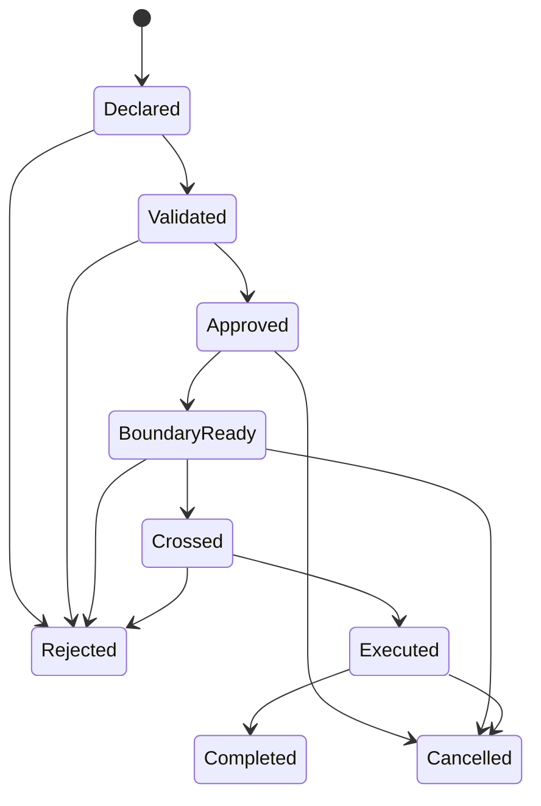

# Execution Architecture RFC

## Status and normative language

This RFC preserves the historical V13.0 declarative architecture and its
normative ownership rules. The words **MUST**, **MUST NOT**, **SHOULD**, and
**MAY** are normative within that scope.

The repository has progressed since V13.0. The current V14.3 operational
composition is documented in `prepared-inbound-runtime-execution.md` and
`runtime-abstraction.md`. The V12 execution-boundary RFC remains normative for
crossing semantics unless a later reviewed contract explicitly supersedes it.

## Current implementation status — V14.3

The repository now contains guarded Runtime and Transport implementations,
Core-owned Runtime admission, dry-run plans, execution receipts, a
transport-neutral inbound handler, and
`executePreparedInboundRuntimeRequest(...)`.

```text
inbound envelope
-> validation/authentication/replay/security
-> decode/authorize/assemble/prepare
-> trusted execution-context resolution
-> Runtime admission and resolution
-> dry-run plan OR one bounded Runtime invocation
-> redacted receipt
```

This operational slice does not make declarative governance evidence executable.
Eligibility, review, provenance, authority, descriptor and boundary evidence
cannot create or widen authority. Concrete identity, ACL, replay persistence,
inbound transport, provider execution and LoopRunner execute mode remain future
deliveries.

## 1. Architecture overview

The V13.0 pipeline was declarative and stopped before operational handoff.

```mermaid
flowchart TD
  Eligibility["HandoffEligibilityResult"] --> Authority["ExecutionAuthority"]
  Authority --> Descriptor["DispatchDescriptor"]
  Descriptor --> Handoff["BoundaryHandoff"]
  Handoff --> BoundaryRFC["ExecutionBoundaryRFC"]
  BoundaryRFC --> Stop["Declarative stop"]
  Stop -. future at V13.0 .-> Bridge["Future Bridge"]
  Bridge -. future at V13.0 .-> Transport["Future Transport"]
  Transport -. future at V13.0 .-> Runtime["Future Runtime"]
```

- **Eligibility** assesses review and provenance consistency; it is not approval.
- **ExecutionAuthority** is bounded authority evidence; it does not dispatch.
- **DispatchDescriptor** is transport-independent and non-executable.
- **BoundaryHandoff** is inactive declarative boundary evidence.
- **ExecutionBoundaryRFC** evaluates crossing invariants and grants nothing.
- **Future Bridge**, **Future Transport**, and **Future Runtime** are the V13.0
  names for the then-future operational layers now represented by separately
  reviewed implementations.

## 2. Responsibility matrix

| Layer | Owns | Does not own | V13.0 state |
| --- | --- | --- | --- |
| Eligibility | Consistency assessment | Approval, authority, handoff | Implemented, declarative |
| Authority | Bounded authority representation | Review, dispatch, execution | Implemented, declarative |
| Dispatch | Transport-independent descriptor | Transport selection, execution | Implemented, declarative |
| Boundary | Descriptor handoff evidence | Crossing, dispatch | Implemented, declarative |
| Boundary RFC | Invariant evaluation | Operational permission | Implemented, declarative |
| Future Bridge | Reviewed boundary conversion | Runtime execution | Future RFC at V13.0 |
| Future Transport | Imperative handoff evidence | Policy interpretation | Future implementation at V13.0 |
| Future Runtime | Bounded completion | Authority creation | Future implementation at V13.0 |

## 3. Ownership

| Layer | Inputs | Outputs | Allowed dependencies | Forbidden dependencies |
| --- | --- | --- | --- | --- |
| Eligibility | Reviewed request and provenance | `HandoffEligibilityResult` | Declarative contracts | CLI, implementations, process, network |
| Authority | Eligibility evidence | `ExecutionAuthority` | Eligibility and version references | Runtime/Transport implementations |
| Dispatch | Eligibility and authority | `DispatchDescriptor` | Declarative authority | Adapter payloads, execution |
| Boundary | Descriptor result | `BoundaryHandoffResult` | Descriptor contracts | Runtime/Transport implementations |
| Boundary RFC | Boundary handoff | `ExecutionBoundaryResult` | Boundary evidence | Requests, adapters, execution |
| Future Bridge | Valid boundary and explicit authority | Transport-facing contract | Reviewed evidence | Raw input, implicit authority, ambient state |
| Future Transport | Bridge contract | Start/non-start evidence | Selected transport contract | Authority mutation |
| Future Runtime | Valid transport handoff | Completion evidence | Selected runtime contract | Approval and CLI input |

Ownership MUST remain single-purpose. A layer MUST NOT consume a downstream
implementation to prove that its own result is valid.

## 4. Execution boundary

At V13.0 the execution boundary was not implemented. The design required an
explicit Core-owned Bridge after declarative validation, explicit approval,
valid authority, valid descriptor, valid boundary evidence and audit
preconditions.

Only bounded references, correlation identifiers, reviewed versions and audited
metadata MAY cross. Raw payloads, inferred approval, ambient state, credentials,
commands, executable paths and unbounded output MUST NOT cross.

The future Bridge owns the crossing. Core MUST validate the crossing before the
Bridge is called, and Transport MUST independently validate that the contract is
scoped to it. Neither provider, Runtime nor Transport MAY create, widen or forge
authority. V14.3 preserves this rule through trusted injected context and Runtime
admission before resolution or invocation.

## 5. State machine

The V13.0 state machine remains a governance model. V14.3 uses a separate
application result and does not mutate it.


```mermaid
stateDiagram-v2
  [*] --> Declared
  Declared --> Validated
  Declared --> Rejected
  Validated --> Approved
  Validated --> Rejected
  Approved --> BoundaryReady
  Approved --> Cancelled
  BoundaryReady --> Crossed
  BoundaryReady --> Rejected
  BoundaryReady --> Cancelled
  Crossed --> Executed
  Crossed --> Rejected
  Executed --> Completed
  Executed --> Cancelled
```

- **Declared**: immutable evidence exists.
- **Validated**: deterministic checks pass.
- **Approved**: approval is explicit and scoped.
- **BoundaryReady**: crossing preconditions remain valid.
- **Crossed**: reviewed handoff evidence exists.
- **Executed**: the Runtime reported start.
- **Completed**: bounded completion evidence exists.
- **Rejected**: a required condition failed closed.
- **Cancelled**: explicit cancellation ended the lifecycle.

No declarative V13.0 result alone MAY reach Crossed, Executed or Completed.

## 6. Invariant catalogue

| Layer | Invariants |
| --- | --- |
| Provider, mapping and intent | Static registries, validated compatibility, disabled defaults |
| Policy and authorization | Default deny, explicit references, no inferred authority |
| Transport request and review | Immutable requests, deterministic review, review is not approval |
| Provenance and eligibility | Evidence only, complete versions and scope, default not eligible |
| Authority and descriptor | Bounded, immutable, transport-independent and non-executable |
| Boundary handoff | Inactive, unaccepted, non-dispatchable and default-denied |
| Boundary RFC | Authority, eligibility, descriptor, evidence, policy, review, configuration and isolation checks |
| Operational V14.3 boundary | Reuse inbound gates, inject trusted context, admit before resolve, dry-run before invoke, redact output |

Invariant evaluation MUST be deterministic. Missing, unknown or inconsistent
evidence MUST fail closed.

## 7. Threat model

| Threat | Required mitigation |
| --- | --- |
| Accidental execution | Explicit mode, Runtime admission, dry-run before invocation |
| Privilege escalation | No layer widens authority or infers approval |
| Runtime bypass | Runtime is reached only through audited Core boundaries |
| Transport bypass | Transport cannot consume raw inbound/governance payloads |
| Provider bypass | Providers cannot create authority or execution context |
| Descriptor forgery | Immutable evidence and reference/version checks |
| Authority forgery | Explicit scoped authority only |
| Boundary forgery | Deterministic default-deny boundary checks |
| Review bypass | Review/provenance consistency plus separate operational admission |

## 8. Security model

The architecture is default-deny. Contracts are immutable, validation is
reproducible, effectful dependencies are injected, and operational boundaries do
not discover credentials or authority from ambient state.

Review is evidence, not an execution permit. Approval MUST be explicit, scoped,
versioned, reviewable and revocable. Public audit evidence MUST distinguish
non-start from start without exposing secrets.

## 9. Operational roadmap

| Status | Scope |
| --- | --- |
| Already implemented | Declarative governance; guarded Runtime/Transport; admission, plans, receipts; inbound handler; V14.3 vertical slice |
| Future RFC | Durable cancellation, recovery, persistence, identity/ACL and credential boundaries |
| Future implementation | LoopRunner execute/validate/repair; concrete identity/ACL/replay; one inbound adapter; one provider pilot; commit mode |

Future implementation MUST preserve existing public contracts unless separately
versioned and reviewed.

## 10. Explicit non-goals

The V13.0 baseline did not introduce:

- `RuntimeRequest`;
- `TransportRequest`;
- execution;
- a Bridge;
- adapter payloads;
- provider invocation;
- transport invocation;
- runtime invocation;
- commands, arguments, binaries, shells or process APIs;
- filesystem, network, credential or environment access.

V14.3 adds only the reviewed Core application-service composition. It does not
add a network listener, concrete identity/ACL/replay implementation, provider
invocation, LoopRunner execute mode, repair, commit, publication, persistence,
resume or ambient secret discovery.
