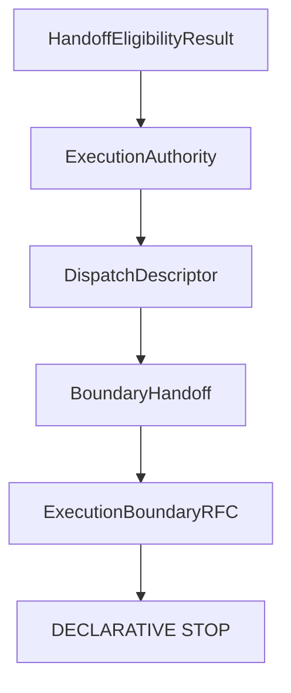

# Execution Boundary RFC contracts

V12.4 introduces `ExecutionBoundaryRFC`, the immutable contract layer that
states which invariants must hold before any future execution boundary could be
considered. The module is still declarative. It does not implement a boundary
and it does not create an operational payload.

## Responsibility

`ExecutionBoundaryRFC` consumes a `BoundaryHandoffResult` and produces an
`ExecutionBoundaryResult`. The result records invariant definitions,
requirement outcomes, evidence references, validation diagnostics and summary
flags.

It describes only:

- required invariants;
- required reviews and approvals;
- required authority, eligibility, descriptor and boundary state;
- required evidence and policy references;
- deterministic diagnostics.

It does not describe operational behavior.

## Position in V12

No edge exists from `ExecutionBoundaryRFC` to transport, runtime, provider or
dispatch layers.

## Invariant catalogue

Each invariant family is independently evaluable and has stable requirement
outcomes: `pass`, `fail` or `unknown`.

| Family | Purpose |
| --- | --- |
| `authority` | Authority evidence is explicit and not executable. |
| `eligibility` | Eligibility evidence is explicit and not dispatchable. |
| `descriptor` | Descriptor evidence is complete and not accepted as a payload. |
| `boundary` | Boundary handoff evidence is valid and remains below the boundary. |
| `evidence` | Required references and versions are present. |
| `policy` | Policy evidence is explicit and does not grant crossing. |
| `review` | Review and provenance evidence are present. |
| `configuration` | Configuration evidence is present and normalized. |
| `transport_isolation` | Transport is referenced only by contract version. |
| `runtime_isolation` | Runtime is referenced only by contract version. |

## Builder

`createExecutionBoundaryRFC()` is the only builder introduced by this milestone.
It accepts only `BoundaryHandoffResult` and returns only
`ExecutionBoundaryResult`.

The builder MUST remain:

- pure;
- deterministic;
- side-effect free;
- immutable;
- non-operational.

## Default-deny result

Every produced result keeps the execution boundary closed:

- `boundarySatisfied: false`
- `crossingAllowed: false`
- `dispatchable: false`
- `executable: false`
- `executionStarted: false`

These flags are not temporary execution controls. They are contract guarantees
for this milestone.

## Security guarantees

The RFC contract module MUST NOT contain executable material, process
configuration, command construction, environment access, credential handling,
filesystem discovery, network access, adapter invocation, dispatch or execution.

The module MAY reference declarative contract versions for runtime and
transport evidence. It MUST NOT consume runtime, transport or provider
implementations.

## Relationship with the V12 RFC

`docs/architecture/rfc-execution-boundary-v12.md` remains the normative
specification. This contract layer models the invariant catalogue implied by
that RFC without implementing future operational concepts.
