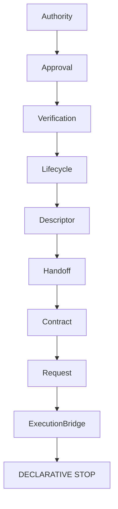

# Execution Bridge RFC

Execution Bridge is the immutable declarative contract by which a future executable bridge may consume a valid Bridge Request. It is not authorization, not execution, not runtime, not transport, not provider dispatch, scheduler, or executor, and causes no side effects.

It validates caller-supplied identifiers, versions, explicit evaluation time, constructible Bridge Request reference and denied upstream execution flags. Evaluation is deterministic and serializable. `executionAllowed` remains false and `executionStarted` remains false. Future RuntimeRequest, TransportRequest and ProviderRequest are out of scope; extension requires a separate RFC. No network, filesystem, process, adapter, provider, or execution surface exists.
