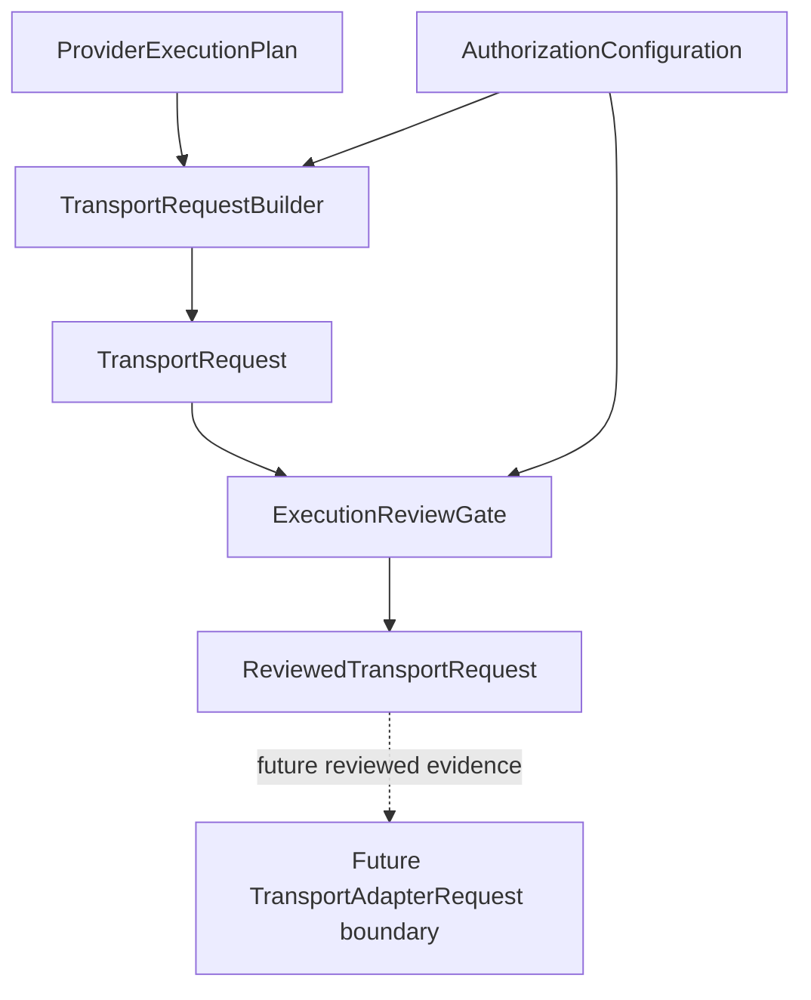

# Execution Review Gate V11.3

`ExecutionReviewGate` is the declarative review boundary after
`TransportRequestBuilder` and before any future execution handoff.

It accepts only:

- `TransportRequest`
- `AuthorizationConfiguration`

It produces only:

- `ReviewedTransportRequest`

It does not produce `TransportAdapterRequest`, `RuntimeRequest`,
`ExecutionPlan`, or any dispatch payload.

## Responsibility

The review gate verifies that the immutable `TransportRequest` is still
consistent with the authorization configuration that allowed it to be built.
It records review metadata and preserves a structured denial state for any
future handoff.

The gate checks:

- authorization consistency;
- configuration consistency;
- policy references;
- mapping references;
- intent references;
- runtime references;
- transport references;
- capability references;
- review and approval state;
- version compatibility where version metadata is present.

## Lifecycle

Every phase in this document remains before the execution boundary defined by
`docs/architecture/rfc-execution-architecture-v11.md`.

## Invariants

The review gate MUST:

- be deterministic;
- be side-effect free;
- preserve immutable output;
- preserve `executionStarted: false`;
- return stable structured diagnostics;
- keep `ReviewedTransportRequest.approved` as `false`;
- keep `ReviewedTransportRequest.dispatchable` as `false`;
- keep `ReviewedTransportRequest.executable` as `false`;
- keep `ReviewedTransportRequest.handoffAllowed` as `false`.

The review gate MUST NOT:

- execute anything;
- dispatch anything;
- call Runtime;
- call Transport;
- call Provider;
- create `TransportAdapterRequest`;
- create `RuntimeRequest`;
- create process payloads;
- describe commands, arguments, binaries, environment, credentials, paths,
  process options, network, or filesystem discovery.

## Approval lifecycle

V11.3 does not implement human approval. A successful review means only that
the request and configuration references are internally consistent. It does
not mean execution is approved.

`ReviewedTransportRequest` therefore defaults to:

- `approved: false`
- `dispatchable: false`
- `executable: false`
- `handoffAllowed: false`

Future approval work MUST be a separate reviewed lot and MUST NOT infer
approval from the existence of a reviewed request.

As of V11.4, `ApprovalProvenance` records descriptive review evidence for a
`ReviewedTransportRequest`. It remains evidence only and does not authorize
execution. See `docs/architecture/approval-provenance.md`.

As of V11.5, `HandoffEligibility` may assess the reviewed request and approval
provenance together. The eligibility result remains declarative and creates no
transport adapter request. See `docs/architecture/handoff-eligibility.md`.

## Relationship with TransportRequest

`TransportRequest` is the immutable declarative request produced by the sole
builder. `ExecutionReviewGate` does not rebuild it and does not widen it. It
only records reviewed evidence derived from the request and the matching
authorization configuration.

## Relationship with future TransportAdapterRequest

A future `TransportAdapterRequest` MAY use a `ReviewedTransportRequest` as
input only after a separately reviewed approval and handoff boundary exists.
This document does not define that adapter request and does not authorize its
creation.

## Security model

The gate is default-deny. Validation failures return structured
`ExecutionReviewError` values with `executionStarted: false`. A valid review
still denies handoff.

There is no hidden execution path through review metadata, summaries,
diagnostics, fixtures, Core wrappers, tests, docs, or audit rules.
