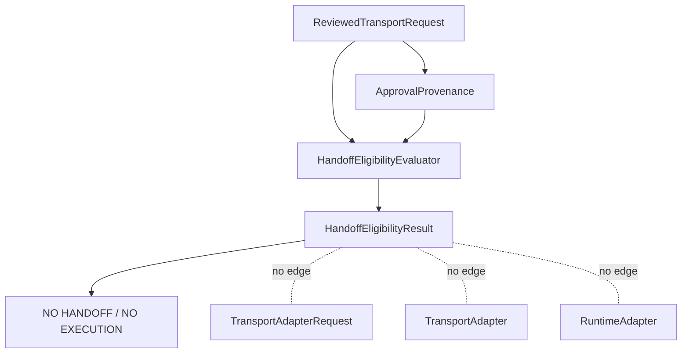

# Handoff Eligibility V11.5

`HandoffEligibility` is a declarative assessment of reviewed evidence. It
answers whether existing local contracts are internally consistent enough for a
possible future handoff to be considered.

It is not authorization. It is not an execution permit. It is not a transport
request. It performs no handoff.

## Inputs

`HandoffEligibilityEvaluator` accepts only:

- `ReviewedTransportRequest`;
- `ApprovalProvenance`.

It does not accept a `TransportAdapterRequest`, `TransportAdapter`,
`RuntimeRequest`, `RuntimeAdapter`, provider implementation, CLI context,
LoopRunner context, process state, filesystem state, network state, or
environment variables.

## Output

The evaluator produces only `HandoffEligibilityResult`. The result contains:

- a declarative decision;
- ordered requirement outcomes;
- structured evidence references;
- safe diagnostics;
- immutable summary metadata.

It never contains commands, arguments, binary paths, executable paths,
environment variables, credentials, filesystem paths, network endpoints,
process identifiers, adapter payloads, runtime payloads, dispatch
instructions, or execution instructions.

## Boundary

No edge exists from `HandoffEligibilityResult` to `TransportAdapterRequest`,
`TransportAdapter`, or `RuntimeAdapter`.

## Eligibility decisions

The stable decisions are:

- `eligible`;
- `not_eligible`;
- `indeterminate`.

The default decision is `not_eligible`. Eligibility MUST NOT be inferred from
missing evidence. Unknown or incomplete evidence produces `indeterminate` or
`not_eligible`, never `eligible`.

Because V11.3 and V11.4 defaults explicitly remain not approved, current
default evidence evaluates conservatively as not eligible.

## Requirement outcomes

Each requirement has one stable outcome:

- `pass`;
- `fail`;
- `unknown`.

Requirements are evaluated in deterministic order:

- `review_present`;
- `review_complete`;
- `review_consistent`;
- `review_approved`;
- `provenance_present`;
- `provenance_complete`;
- `provenance_consistent`;
- `scope_consistent`;
- `policy_version_consistent`;
- `configuration_version_consistent`;
- `mapping_version_consistent`;
- `protocol_version_consistent`;
- `runtime_contract_version_consistent`;
- `transport_contract_version_consistent`;
- `architecture_version_consistent`;
- `request_non_executable`;
- `adapter_request_absent`.

Every result remains deeply immutable.

## Difference from approval evidence

`ApprovalProvenance` records what was reviewed. `HandoffEligibility` evaluates
whether that provenance and the reviewed request are internally consistent.
Neither contract proves that execution should start.

## Difference from authorization

Authorization configuration and policy evaluation describe whether requirements
are allowed by local declarative policy. Handoff eligibility does not grant
authority. It only assesses whether evidence is coherent enough for a future
separate boundary to inspect.

## Difference from handoff

A handoff would be the future Core-owned imperative boundary described by the
V11 RFC. V11.5 does not implement that boundary. An eligible result, if future
contracts can explicitly represent one, still performs no handoff and creates
no adapter request.

## Relationship with future TransportAdapterRequest bridge

A future bridge MAY consume `HandoffEligibilityResult` as one input to a
separately reviewed design. That bridge does not exist in V11.5. Eligibility
MUST NOT be treated as a transport adapter request or execution capability.

## Security guarantees

The evaluator is a pure function. It does not read time, randomness, machine
state, filesystem state, network state, process state, or environment
variables.

It does not spawn, execute, dispatch, invoke Runtime, invoke Transport, create
commands, build arguments, reference binaries, carry credentials, or cross the
execution boundary.
