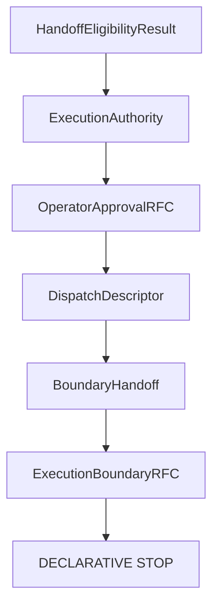
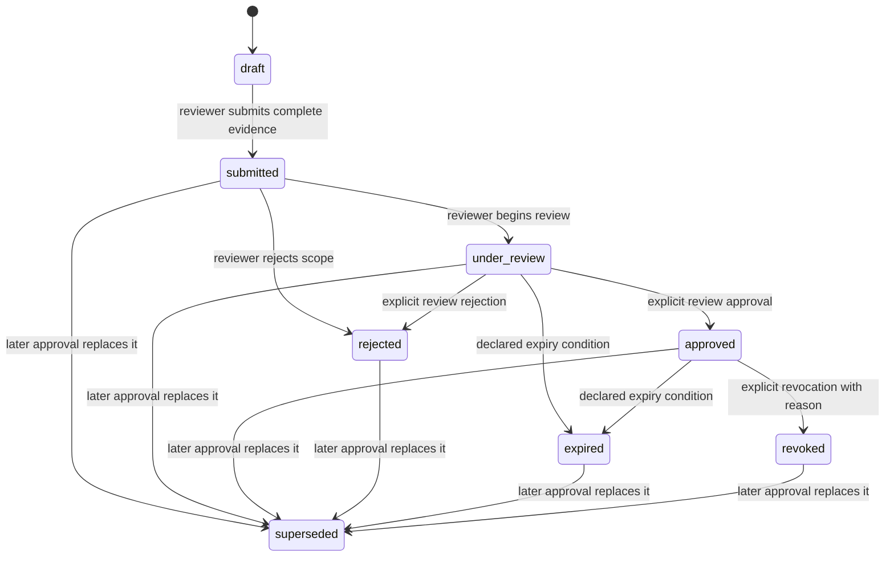
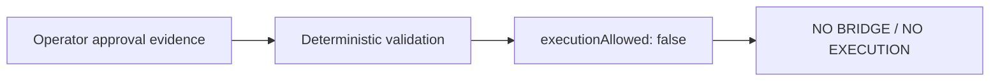

# Operator Approval RFC

## Status and scope

V13.1 defines the declarative lifecycle of **Operator Approval** for an
existing `ExecutionAuthority`. The words **MUST**, **MUST NOT**, **SHOULD** and
**MAY** are normative. This RFC is evidence and lifecycle specification only;
it does not create a boundary crossing or an operational capability.

Operator Approval is distinct from review, eligibility, authorization,
authority, dispatch, transport and runtime. Approval records an explicit human
decision about a reviewed scope. It does not itself allow execution.

## Position in the architecture

`OperatorApprovalRFC` MAY reference an authority and its reviewed evidence. It
MUST NOT create a Bridge, a request, a payload, a dispatch, or an invocation.

## Lifecycle and state machine

Every transition is explicit. A state change MUST record the previous state,
reviewer identity, review timestamp, scope, approval version, evidence
references and expiry policy.

| State | Meaning | Required flags |
| --- | --- | --- |
| `draft` | Initial declaration; no review decision | `approved: false`, `revoked: false`, `expired: false` |
| `submitted` | Complete evidence submitted for review | all flags false |
| `under_review` | Reviewer is assessing declared evidence | all flags false |
| `approved` | Explicit scoped approval recorded | `approved: true`, other flags false |
| `rejected` | Explicit decision not to approve | all flags false |
| `expired` | Approval is no longer current under its declared policy | `expired: true`, `approved: false` |
| `revoked` | Approval was withdrawn with an explicit reason | `revoked: true`, `approved: false` |
| `superseded` | A newer approval declaration replaces this record | all flags false |

No state, including `approved`, sets `executionAllowed` to true in V13.1.

## Review model

An approval review MUST contain only declarative traceability:

- an abstract reviewer identity;
- a supplied review timestamp;
- a bounded approval scope;
- an approval version;
- sorted evidence references;
- an explicit expiry policy;
- an explicit revocation reason whenever state is `revoked`.

The model intentionally has no identity provider, authentication token,
signature, credential, device state, current clock lookup, or external review
service. A timestamp and expiry status are supplied evidence and are validated
for consistency; this RFC does not inspect current time.

## Validation

Validation is pure and deterministic. It verifies authority presence, reviewer
identity, timestamp, scope, version, evidence references, expiry policy,
declared transition, state/flag consistency, revocation reason, expiry, and
revocation. Missing or inconsistent evidence fails closed.

An expired or revoked review is structurally traceable but invalid for a future
approval path. An approved review is also only evidence: a separate future
authority and boundary review would still be required before any future Bridge
could be considered.

## Security guarantees

The model preserves default deny, explicit approval, immutable approvals,
review traceability, revocation traceability and expiry enforcement.

- Approval MUST NOT be inferred from object presence, eligibility, authority
  status, validation success, or a previous record.
- All builder outputs, nested evidence, reviews, requirements, diagnostics,
  summaries and errors are deeply immutable.
- The builder and validators MUST NOT use time, randomness, process state,
  filesystem state, network state or environment state.
- The approval lifecycle MUST NOT widen policy, alter an authority, or create a
  transport-facing artifact.

## Non-goals

This RFC does not introduce a Bridge, RuntimeRequest, TransportRequest,
TransportAdapterRequest, commands, execution payloads, provider payloads,
runtime payloads, transport payloads, provider invocation, transport
invocation, runtime invocation, or execution.

The pipeline remains declarative:

