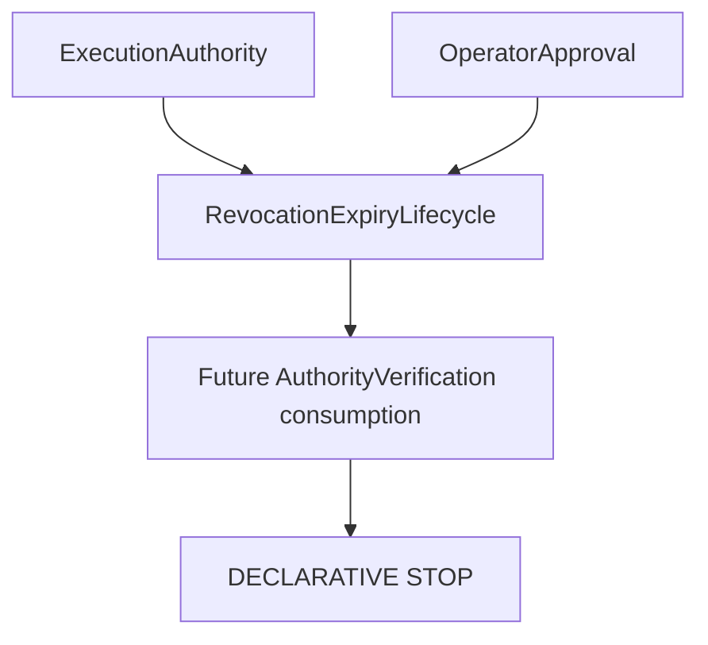

# Revocation & Expiry Lifecycle RFC

## Purpose and architectural position

V13.3 defines immutable declarative governance lifecycle evidence for execution authority and operator approval. It sits between those artifacts and Authority Verification, with no implementation edge to Authority Verification, Dispatch, Boundary, Runtime, Transport, Provider, CLI or LoopRunner.

## Subjects, states, and events

Supported subjects are exact-version `execution_authority` and `operator_approval`. States are `active`, `not_yet_valid`, `expired`, `revoked`, `superseded`, `replaced`, `invalid`, and `unsupported`. Events are `issued`, `activated`, `expiry_scheduled`, `expired`, `revocation_requested`, `revoked`, `superseded`, `replacement_declared`, `reviewed`, and `corrected`.

Every event records only an identifier, type, exact subject/version, issuer, occurrence and effective timestamps, reason, evidence, review, scope, optional supersession reference and correlation reference.

## Time, expiry, and precedence

All evaluation uses explicit `evaluationAt`; no ambient clock is read. `validFrom` is inclusive; `validUntil` and `expiresAt` are exclusive. `revokedAt`, `supersededAt`, and `replacementEffectiveAt` are effective at their supplied instant. Terminal precedence is `invalid > revoked > superseded > replaced > expired > not_yet_valid > active`.

Expiry is a time-based governance state. Revocation is an explicit governance action. A request is not effective revocation: only a reviewed `revoked` event with evidence becomes effective.

## Revocation, supersession, and replacement

Revocation requires an exact subject/version, effective time, reason, attributable issuer, evidence and complete review. It is immutable and cannot restore an artifact in place. Supersession creates historical obsolescence; it does not delete history. Replacement creates a new artifact/version, must differ from the previous reference, include an effective time, issuer and evidence, and must not form a declared cycle.

Scopes are `exact_version` by default, with explicit `all_prior_versions` and `subject_family` alternatives. No broad scope is inferred.

## Issuer, reviewer, evidence, validation, and errors

Issuer and reviewer are separate declarative identity references. Evidence contains only identifiers, timestamps and safe notes: never credentials, secret values, commands or payloads. Structural validation checks fields, supported types, timestamps, exact subject/version, scope, issuer, evidence, review, duplicate identifiers and ordering. Semantic evaluation applies the documented precedence only to supplied values. Diagnostics are stable and safe.

## Default deny, security, and non-goals

Missing or malformed data is `invalid` or `unsupported`, never active. `active` does not mean approved, verified, or executionAllowed. Every result retains `executionAllowed: false` and `executionStarted: false`.

This RFC introduces no Bridge, RuntimeRequest, TransportRequest, TransportAdapterRequest, executable, command, argument list, shell, binary path, working directory, process configuration, credential, environment access, filesystem access, network access, dynamic discovery, external clock, dispatch, Runtime execution, Transport execution or Provider execution.

Future Authority Verification MAY consume lifecycle contracts through a one-way, contract-only dependency. Any future Bridge requires a separate RFC.
