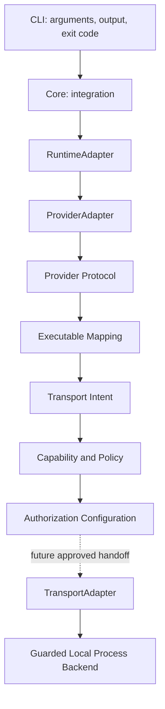
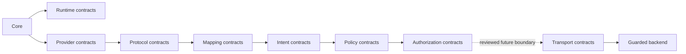
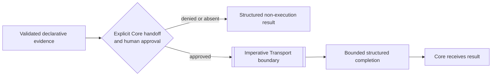
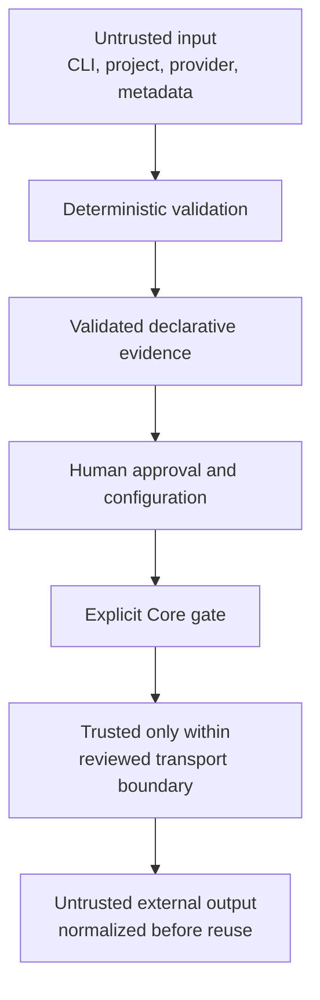
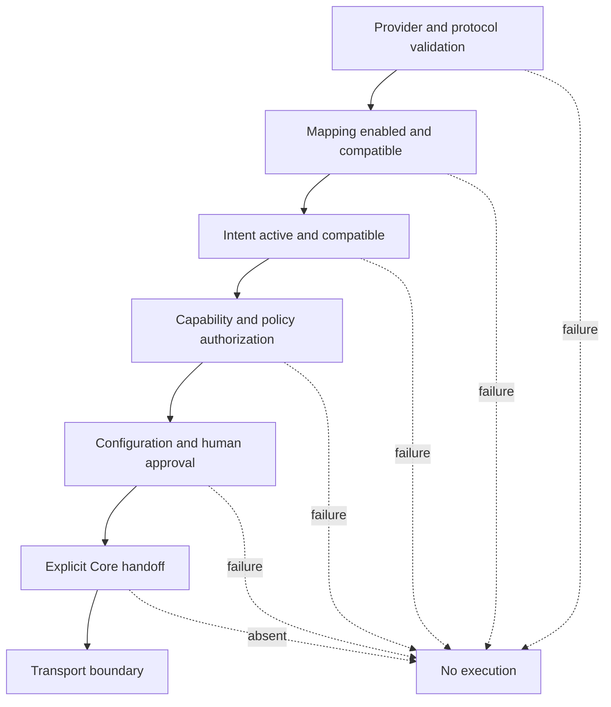
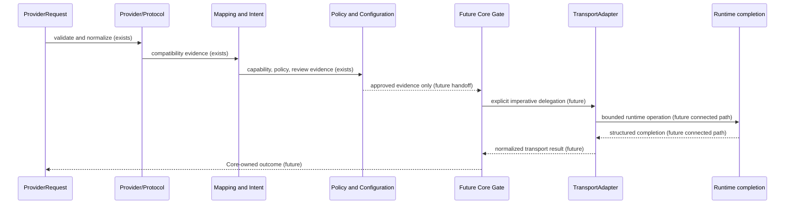

# RFC — Execution Architecture V11

## Status and normative language

This RFC is the normative architectural specification for future Loop Engine
execution work. The words **MUST**, **MUST NOT**, **SHOULD**, and **MAY** are
normative. This document creates no executable capability, API, schema, or
request contract.

## 1. Background

V9 introduced Core as the internal integration point and made the CLI a thin
adapter. V10 then separated Runtime, Provider, Provider Protocol, Executable
Mapping, Transport Intent, Capability & Policy, and Authorization
Configuration. V10.9 consolidated their common registry invariants without
joining their domain responsibilities.

Execution was intentionally delayed. A valid Provider protocol is not proof
that an executable exists; a mapping is not proof that it is enabled; an
enabled declaration is not authorization; and authorization is not human
approval. The preceding versions therefore establish deterministic,
default-deny evidence before any future imperative action is considered.

## 2. Current architecture

The CLI parses arguments, calls Core, prints results, and returns exit codes.
Core is the internal integration point. Runtime identifies an abstract backend;
Provider normalizes a provider-neutral request; Protocol validates provider
semantics; Mapping describes protocol compatibility; Intent describes desired
transport capability; Policy evaluates capability and policy compatibility; and
Authorization Configuration records reviewable requirements. Transport owns
the guarded local backend boundary. These responsibilities MUST remain
separate.

Dependencies MUST point from an integrating layer to contracts below it. A
declarative layer MAY consume lower-level types, but MUST NOT import a concrete
Provider, Runtime, Transport, CLI, LoopRunner, process API, or discovery
mechanism merely to make a decision. Registries MUST remain static, immutable,
ordered, and deterministic.

## 3. Execution boundary

Execution begins only when a future Core-owned operation explicitly hands an
already validated and human-approved unit of work to a selected
`TransportAdapter`. The boundary is imperative at that handoff: it is the first
point at which an external side effect MAY be requested. Validation, selection,
planning, mapping, intent, policy evaluation, authorization configuration,
report rendering, and CLI parsing MUST remain declarative and side-effect free.

Execution ends when the selected Transport produces a bounded, structured
completion result and control returns to Core. Provider normalization MAY
translate that result without invoking another side effect. No layer MAY infer
that a result permits a retry, commit, publish, or additional execution.

The CLI, LoopRunner plan mode, Provider adapters, protocols, mappings, intents,
policy, authorization configuration, reports, and audit rules MUST NOT start
execution. A configuration being compatible, active, or approved MUST NOT by
itself cross the boundary.

## 4. Trust model

Trusted components are Loop Engine's versioned local source, static registries,
deterministic validators, reviewed policy/configuration data, and the guarded
backend only within its documented allow-lists. Trust is contextual: a trusted
component MUST still validate every input at its boundary.

Untrusted inputs include CLI arguments, project files, repository state,
provider-provided text, metadata, protocol payloads, external output, and any
future configuration source until it has been validated and explicitly
approved. They MUST be treated as data, never as authority.

Provider trust is limited to normalized, validated provider semantics; a
Provider MUST NOT be trusted to authorize itself. Runtime trust is limited to
declared capability and selected identity; a Runtime MUST NOT grant policy or
configuration approval. Transport trust is limited to performing a separately
approved handoff and reporting its outcome; a Transport MUST NOT reinterpret
Provider intent or widen an allow-list.

## 5. Security model

The architecture is default-deny. An absence of a mapping, intent, policy,
configuration, approval, or explicit handoff MUST deny execution. Human
approval MUST be explicit, reviewable, and scoped; it MUST NOT be inferred from
successful validation or a prior result.

Capability checks, policy checks, configuration checks, and immutable contract
checks MUST complete deterministically before the execution boundary. The
result of each rejected gate MUST be explainable through safe structured
diagnostics. Validation MUST NOT have hidden side effects, and no layer MAY use
an implicit fallback to a provider, runtime, or transport.

There MUST be no hidden execution. Future work MUST NOT introduce implicit
commands, binaries, shell execution, process APIs, credentials, parent
environment access, network access, discovery, or execution through a report,
audit, registry, selector, or validator.

## 6. Execution lifecycle

The lifecycle below is a target model, not an implementation plan. Existing
V10 contracts provide the declarative phases and a guarded backend capability;
the approved handoff that connects a Provider path to runtime completion is
future work.

Every phase before `CG ->> TA` MUST remain non-executing. The future handoff
MUST preserve a single correlation trail, fixed validation order, explicit
authorization decision, bounded result, and a clear indication of whether
execution started.

## 7. TransportRequest

A future `TransportRequest` is an architectural handoff responsibility, not a
contract defined by this RFC. If introduced in a separately reviewed lot, it
MUST bind only evidence already validated by the declarative layers to one
explicit Transport boundary. It MUST NOT become an alternate policy engine,
Provider protocol, Runtime selector, approval record, or hidden command
carrier.

This RFC deliberately defines no fields, Runtime fields, process fields,
serialization, construction API, or execution behavior for such a request.
Its implementation requires separate approval after the review requirements in
this RFC are met.

## 8. Failure model

Validation, policy, and configuration failures MUST terminate before execution
starts and return stable, safe diagnostics. Runtime and Transport failures MUST
state whether execution started, preserve bounded evidence, and remain distinct
from validation denials. Audit failures MUST block release acceptance until the
architecture and its documented guarantees are restored.

Rollback expectations are conservative: no automatic retry, rollback, commit,
push, or publish MAY be inferred. A future side-effecting feature MUST define
its own compensating-action and operator-review semantics before implementation;
where no safe compensation exists, the result MUST be reported as terminal and
require human direction.

## 9. Observability

Observability MUST favor deterministic, bounded, safe records over ambient
logging. A future execution trail SHOULD associate the validated inputs, policy
and configuration decisions, selected identities, boundary entry, result, and
audit version without exposing secrets or unbounded external output.

Reproducibility requires fixed registry order, explicit versions, immutable
contracts, deterministic validation, and clear separation between declared
evidence and observed completion. Future telemetry MAY exist only behind a
separately reviewed boundary; it MUST NOT become a hidden execution channel or
change local default-deny behavior.

## 10. Review requirements

Any implementation that can cross the execution boundary MUST receive all
applicable reviews before merge:

- **Security review** for authority, allow-lists, input handling, secrets,
  environment isolation, side effects, and failure containment.
- **Architecture review** for dependency direction, declarative/imperative
  separation, contract ownership, determinism, and public compatibility.
- **Provider review** for protocol normalization, capability claims, trust
  assumptions, and absence of provider-controlled authority.
- **Runtime review** for runtime identity, resource boundaries, completion
  semantics, and safe failure reporting.
- **Transport review** for the imperative handoff, authorization revalidation,
  result bounding, and the absence of hidden process or network paths.

## 11. Future roadmap

V11.x SHOULD proceed through reviewable, documentation-backed increments. It
MAY clarify approval provenance, execution correlation, result semantics, and
operator workflow. It MUST NOT collapse Provider, Runtime, Transport, Policy,
or Authorization responsibilities merely to shorten a future implementation.

No V11.x implementation is authorized by this RFC alone. Each prospective
execution capability MUST have a separately scoped design, explicit security
review, compatibility evidence, tests, audit coverage where useful, and a
human decision to implement it.

## Non-goals

This RFC does **not** introduce execution, a `RuntimeRequest`, a
`TransportRequest`, commands, binaries, shell execution, process APIs, runtime
code, provider code, transport code, policy code, mapping code, intent code,
CLI changes, JSON schema changes, or any behavioral change.
