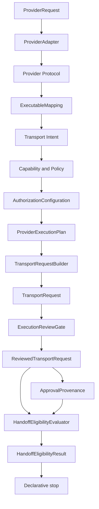
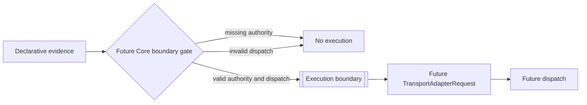
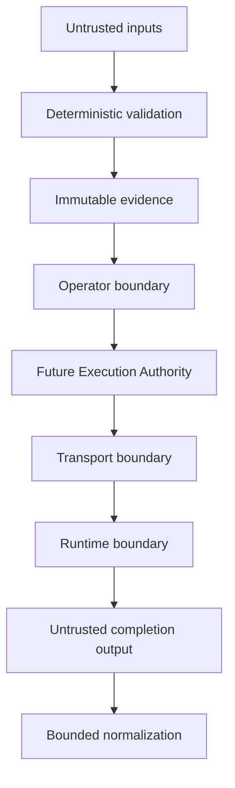
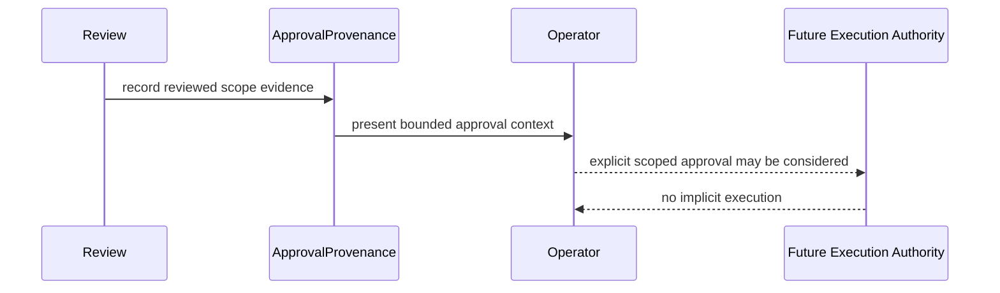
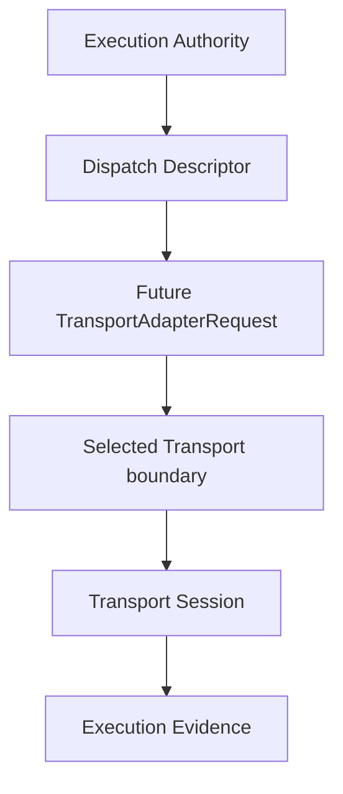
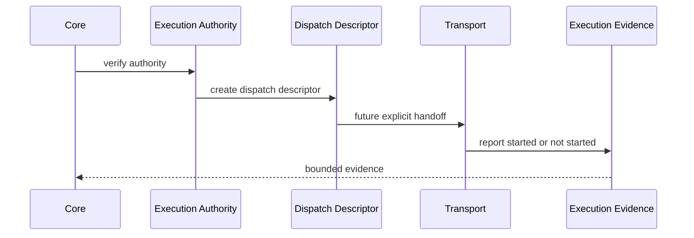
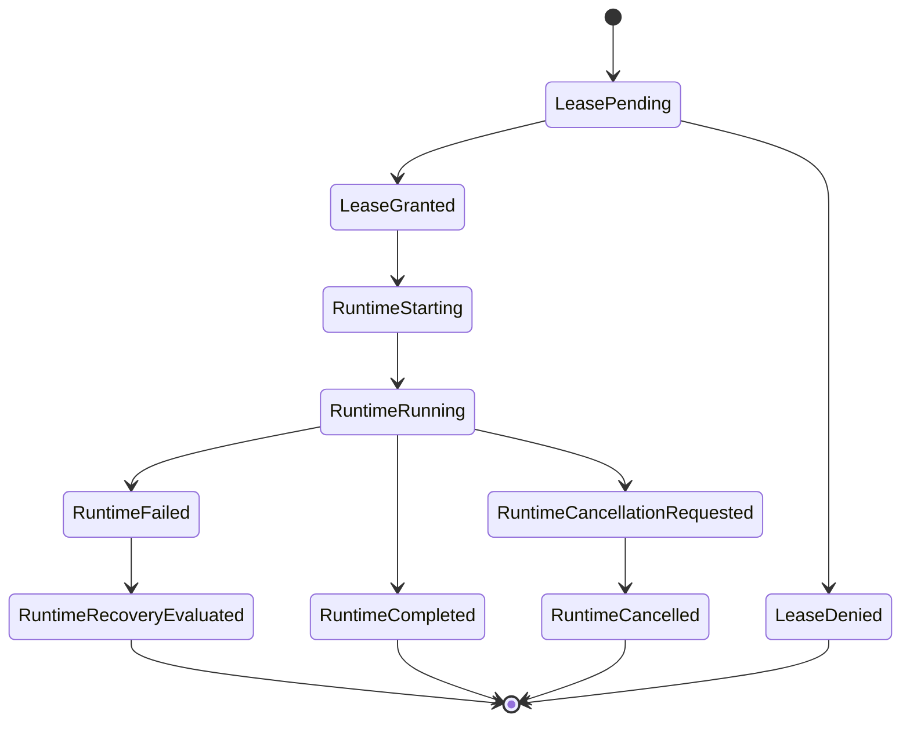
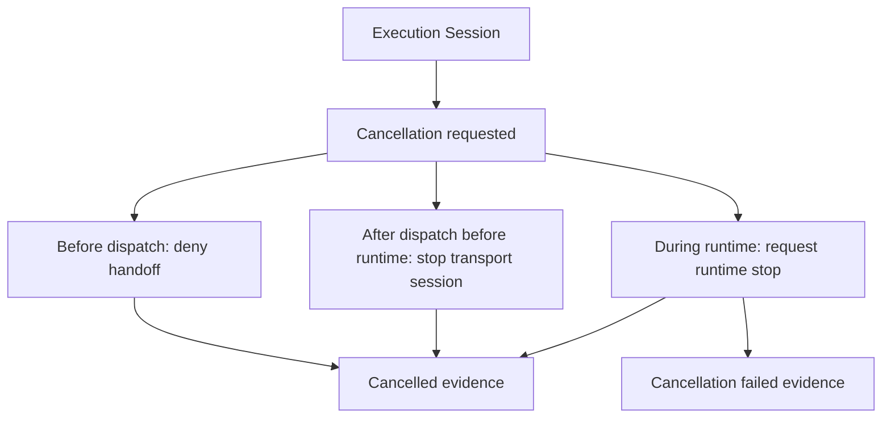
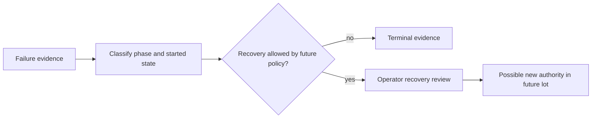
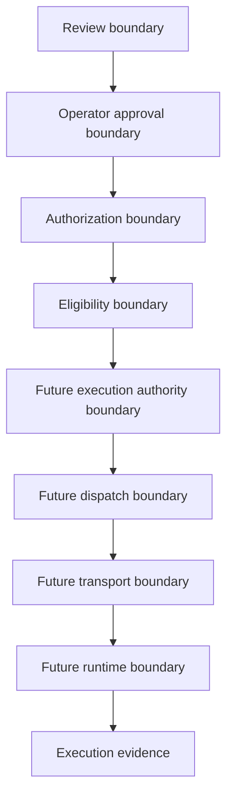

# RFC — Execution Boundary V12

## Status and normative language

This RFC is the normative specification for V12 execution-boundary work. The
words **MUST**, **MUST NOT**, **SHOULD**, and **MAY** are normative.

This document defines future concepts only. It introduces no TypeScript
contract, implementation, adapter, command, dispatch mechanism, runtime
execution, transport handoff, process API, filesystem access, or network
access.

## 1. Current declarative architecture

The stable V11 pipeline is declarative from `ProviderRequest` through
`HandoffEligibilityResult`. Every layer produces evidence, diagnostics, or
assessment data. No layer performs handoff, dispatch, transport execution, or
runtime execution.

Responsibilities MUST remain separated:

- **Review** verifies a `TransportRequest` against authorization
  configuration.
- **Approval** records evidence about who or what abstractly approved the
  reviewed scope.
- **Eligibility** assesses whether existing review and approval evidence are
  internally consistent.
- **Authorization** records policy/configuration decisions and requirements.
- **Execution Authority** is a future explicit authority grant. It does not
  exist in V11.
- **Dispatch** is a future act of preparing an approved authority for a
  selected transport. It does not exist in V11.
- **Execution** is the future imperative act that may cause an external side
  effect.
- **Transport** is the future boundary owner for imperative handoff.
- **Runtime** is the future bounded backend that may perform work only after a
  valid transport handoff.

These terms MUST NOT overlap. No successful review, approval record,
eligibility result, or authorization configuration MAY be treated as execution
authority by itself.

## 2. Execution boundary

The execution boundary is the first future point where declarative evidence is
converted into an imperative request to a selected transport. Nothing crosses
that boundary unless a future, explicit Core-owned operation can prove all of
the following:

1. the declarative pipeline completed;
2. operator approval is explicit and scoped;
3. eligibility is explicit and non-inferred;
4. execution authority exists and is valid;
5. the dispatch descriptor is valid;
6. audit evidence can record whether execution started.

What may cross the boundary in future V12 work:

- a bounded execution authority reference;
- a dispatch descriptor;
- reviewed and approved evidence references;
- correlation identifiers;
- bounded audit metadata.

What MUST NOT cross the boundary:

- unreviewed provider payloads;
- raw CLI arguments;
- provider-controlled authority;
- inferred approval;
- inferred eligibility;
- ambient process state;
- ambient environment variables;
- unbounded external output;
- secrets or credentials unless a future RFC explicitly defines a reviewed
  secret boundary.

Every layer before the execution boundary MUST remain declarative and
side-effect free.

## 3. Trust model

Trusted components are Loop Engine source code, static registries,
deterministic validators, immutable contracts, and reviewed local
configuration. Trust is scoped. A trusted component MUST still validate its
inputs and MUST NOT inherit authority from another layer unless that authority
is explicitly represented.

Untrusted inputs include CLI arguments, project files, repository state,
provider payloads, metadata, protocol data, runtime output, transport output,
and future operator-provided data until validated.

Provider trust is limited to normalized provider semantics. Runtime trust is
limited to bounded execution after dispatch. Transport trust is limited to the
future handoff boundary and MUST NOT reinterpret provider intent or broaden
authority.

## 4. Operator approval model

**Operator Approval** is a future explicit human-controlled decision that MAY
allow a reviewed scope to be considered for execution authority. Operator
Approval MUST be:

- explicit;
- scoped;
- reviewable;
- versioned;
- revocable before dispatch;
- recorded without exposing credentials;
- distinct from authorization, eligibility, dispatch, and execution.

Operator Approval MUST NOT be inferred from:

- the existence of an approval provenance object;
- passing validation;
- an eligible assessment;
- a selected runtime;
- a selected transport;
- a previous successful run.

## 5. Execution authority model

**Execution Authority** is a future bounded authority object or decision that
MAY permit a future dispatch descriptor to be constructed. It is not approval,
authorization, eligibility, dispatch, execution, transport, or runtime.

Execution Authority MUST include only reviewed references and MUST be rejected
when any reference or version is missing, stale, mismatched, revoked, expired,
or out of scope. It MUST be single-purpose and MUST NOT authorize retries,
commits, pushes, publication, or additional executions unless a future RFC
defines those operations explicitly.

Execution Authority MUST NOT contain command lines, argument arrays, shell
syntax, process options, filesystem discovery, network endpoints, or
credentials.

## 6. Future TransportAdapterRequest lifecycle

A future `TransportAdapterRequest` MAY be introduced only after a separate V12
implementation review. Its lifecycle SHOULD be:

1. derive from valid Execution Authority and a valid Dispatch Descriptor;
2. bind to one selected transport identity;
3. carry only bounded transport-facing references;
4. preserve correlation and audit evidence;
5. remain immutable after construction;
6. be consumed exactly once by the selected transport boundary;
7. produce evidence stating whether execution started.

`TransportAdapterRequest` MUST NOT be created by review, approval provenance,
handoff eligibility, provider protocol, executable mapping, transport intent,
policy, authorization configuration, or CLI parsing.

## 7. Future dispatch lifecycle

**Dispatch** is the future Core-owned transition from execution authority into
a selected transport handoff. Dispatch MUST be explicit, auditable, and
bounded. It MUST fail closed when authority, approval, eligibility, runtime
identity, transport identity, capability, policy, configuration, or audit
preconditions are invalid.

The future lifecycle SHOULD be:

1. receive Execution Authority;
2. verify authority scope and freshness;
3. create a Dispatch Descriptor;
4. select exactly one transport by deterministic rules;
5. construct a future `TransportAdapterRequest`;
6. record dispatch audit evidence;
7. hand off to transport;
8. record whether execution started.

Dispatch MUST NOT be performed by the CLI, Provider, Runtime, Mapping, Intent,
Policy, Authorization, Review, Provenance, Eligibility, reports, or audit
rules.

## 8. Future Runtime lifecycle

**Runtime** is the future bounded backend that may execute work only after a
valid transport handoff. Runtime MUST NOT receive raw provider requests,
approval records, eligibility results, or CLI arguments directly.

The future lifecycle SHOULD be:

1. receive a transport-owned session;
2. validate runtime lease and capability references;
3. start only if execution authority and transport checks remain valid;
4. produce bounded progress evidence;
5. complete, fail, cancel, or recover according to explicit state rules;
6. return completion evidence to transport;
7. never self-authorize additional work.

**Runtime Lease** is a future bounded permission for one runtime session. It
MUST be scoped, revocable where possible, and tied to execution evidence.

## 9. Failure model

Failures MUST remain distinguishable by phase:

- validation failure;
- review failure;
- approval failure;
- eligibility failure;
- authorization failure;
- execution authority failure;
- dispatch failure;
- transport failure;
- runtime failure;
- audit failure;
- cancellation failure;
- recovery failure.

Every failure MUST report whether execution started. Failures before the
transport boundary MUST report `executionStarted: false`. Failures after the
boundary MUST preserve bounded execution evidence and MUST NOT imply retry,
rollback, commit, push, or publication.

## 10. Cancellation model

**Execution Cancellation** is a future operator or system request to stop an
execution session. Cancellation MUST be explicit and auditable. Cancellation
does not mean rollback, recovery, or success.

A future cancellation lifecycle SHOULD distinguish:

- cancellation requested before dispatch;
- cancellation requested after dispatch but before runtime start;
- cancellation requested after runtime start;
- cancellation acknowledged;
- cancellation failed;
- cancellation completed.

## 11. Recovery model

**Execution Recovery** is a future reviewed response to failed or interrupted
execution evidence. Recovery MUST NOT be automatic unless a future RFC
explicitly defines a safe automatic recovery class.

Recovery MUST begin from execution evidence, not provider intent. Recovery MAY
recommend an operator action, but MUST NOT infer a new execution authority,
dispatch, retry, rollback, commit, push, or publish.

## 12. Observability model

**Execution Evidence** is future bounded evidence describing what was approved,
what crossed the boundary, whether execution started, and how the session
ended. It MUST be immutable after recording and safe to expose in reports
without leaking secrets.

Observability MUST be deterministic where possible:

- stable identifiers;
- stable ordering;
- bounded diagnostics;
- explicit phase names;
- explicit version references;
- explicit `executionStarted` state;
- reproducible audit trail.

Telemetry MAY be introduced only by a future reviewed boundary. Telemetry MUST
NOT become hidden execution, hidden dispatch, hidden filesystem access, hidden
network access, or hidden credential access.

## 13. Audit model

**Execution Audit** is future structured evidence that validates boundary
invariants before and after execution. It MUST be able to prove:

- declarative layers did not execute;
- approval was explicit;
- eligibility was not inferred;
- execution authority was valid;
- dispatch was explicit;
- selected transport matched authority;
- runtime lease matched dispatch;
- execution-start state was recorded;
- failure and cancellation states were phase-specific.

Audit rules MUST NOT execute commands, call transports, call runtimes, discover
plugins, read credentials, or alter the worktree.

## 14. Security assumptions

The attack surface includes:

- provider payload injection;
- metadata spoofing;
- stale approval evidence;
- mismatched version references;
- runtime identity confusion;
- transport identity confusion;
- authority replay;
- dispatch replay;
- unbounded output;
- hidden process, filesystem, or network access;
- environment or credential leakage.

Authority boundaries MUST remain explicit:

- review boundary: validates request evidence;
- operator boundary: records human decision;
- authorization boundary: records policy/configuration decision;
- eligibility boundary: assesses consistency;
- execution authority boundary: future authority grant;
- dispatch boundary: future Core-owned handoff preparation;
- transport boundary: future imperative adapter entry;
- runtime boundary: future backend session.

No boundary MAY silently widen the authority granted by another boundary.

## 15. Non-goals

This RFC does not introduce:

- execution;
- dispatch;
- transport adapters;
- runtime adapters;
- commands;
- arguments;
- shells;
- filesystem access;
- network access;
- process APIs;
- TypeScript contracts;
- interfaces;
- builders;
- adapter requests;
- runtime requests;
- provider execution;
- CLI behavior changes;
- JSON schema changes;
- Markdown report changes.

## Future terminology

These are definitions only:

- **Execution Authority**: a future explicit, scoped authority decision that
  may permit dispatch construction.
- **Dispatch Descriptor**: a future declarative handoff descriptor derived
  from valid execution authority.
- **Execution Session**: a future bounded lifecycle from dispatch acceptance to
  terminal execution evidence.
- **Transport Session**: a future transport-owned handoff lifecycle.
- **Operator Approval**: future explicit human approval for a reviewed scope.
- **Runtime Lease**: future bounded permission for one runtime session.
- **Execution Evidence**: future bounded evidence of boundary crossing,
  started state, progress, completion, failure, cancellation, or recovery.
- **Execution Audit**: future structured verification of execution-boundary
  invariants.
- **Execution Cancellation**: future explicit request to stop a pending or
  active execution session.
- **Execution Recovery**: future reviewed response to failed or interrupted
  execution evidence.

## Roadmap

### V12.1 — Documentation

V12.1 SHOULD refine operator workflows, evidence examples, and review
checklists without implementation.

### V12.2 — Implementation

V12.2 MAY introduce the first reviewed execution-boundary contracts only if
they preserve this RFC's terminology and non-overlap invariants.

### V12.3 — Validation

V12.3 SHOULD add focused validation and audit coverage for any V12.2 contract
work, with no broadening of execution authority.

### V12.4 — Hardening

V12.4 SHOULD harden cancellation, recovery, replay resistance, observability,
and audit evidence before any broader execution capability is considered.
