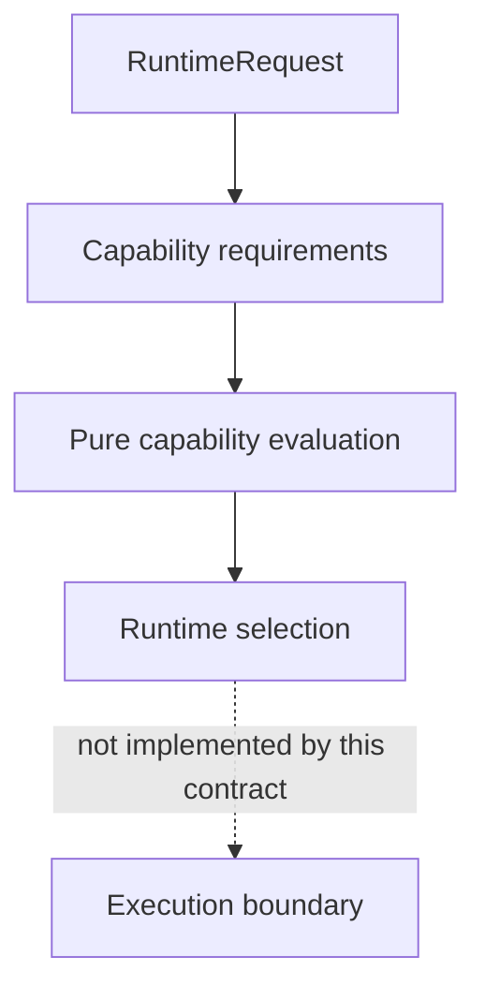

# Runtime Capability RFC

## Status and reconciled responsibility

V13.13 keeps Runtime Capability as immutable metadata only and separates four
responsibilities that previously shared one vocabulary:

- a **Capability declaration** (`RuntimeCapabilityInput`) states what a runtime
  can provide and which constraints it declares;
- a **Capability requirement** (`RuntimeCapabilityRequirementInput`) states
  what a declarative Runtime Request needs and which constraints it accepts;
- validation checks the structure of each contract independently;
- pure evaluation compares one requirement with one declaration and produces
  deterministic compatibility evidence.

Neither declaration nor requirement is an authorization, permission, adapter,
runtime handle, command, or executable callback.



## Compatibility model

Compatibility is default-deny and requires all of the following:

1. declaration and requirement are structurally valid;
2. capability identifier, category, and version match exactly;
3. every required feature appears in `supportedFeatures`;
4. every `declaredConstraint` appears in `acceptedConstraints`.

Additional supported features are allowed. Missing features and unaccepted
constraints are sorted lexically and exposed as immutable diagnostics. Exact
version matching is deliberate: no implicit semantic-version policy or
compatibility inference exists in this lot.

## Validation, evaluation, selection, and execution

Validation answers whether one input is structurally usable. Evaluation answers
whether a valid declaration satisfies a valid requirement. Runtime selection
uses the requirements carried by a Runtime Request, the eligible descriptor
metadata in a Runtime Registry, and an explicit capability catalog. It chooses
the lexically first compatible descriptor identifier as a deterministic
tie-break and returns all compatible identifiers as evidence.

Selection returns no `RuntimeAdapter`, provider, callback, command, or execution
payload. It always preserves `executionAllowed: false` and
`executionStarted: false`. The V10 `resolveRuntime` and `executeRuntime` APIs
remain separate legacy operational surfaces and are neither called nor inferred
by capability selection.

## Runtime Capability and AgentCapability

`RuntimeCapability` and `AgentCapability` are intentionally different:

- `RuntimeCapability` describes versioned runtime metadata and is evaluated
  against a runtime requirement;
- `AgentCapability` is a closed set of agent-policy labels used to select an
  agent profile;
- the V10 `RuntimeAdapter.capabilities` field retains `AgentCapability` labels
  for backward compatibility only;
- there is no implicit conversion, inheritance, alias, or permission mapping
  between the two models.

Any future mapping must be explicit, pure, reviewed as a separate contract, and
must not turn capability metadata into execution authority.

## Dependencies and public surface

The allowed dependency direction for the reconciled path is:

```text
Runtime Request -> Runtime Capability contracts
Runtime Resolution -> Runtime Request + Runtime Registry + Runtime Capability
Core facade -> declarative Runtime modules
```

Runtime Capability and declarative Runtime Resolution do not import Agents,
Policy, Context, Provider, Transport, the V10 runtime adapter contract, or an
execution module. Core re-exports the reconciled pure APIs without changing the
CLI, public JSON schema, or `LoopRunResult`.

Because V10 already exports `createRuntimeRequest`, the Core facade exposes the
V13 request and registry factories under the additive aliases
`createDeclarativeRuntimeRequest` and `createDeclarativeRuntimeRegistry`. The
legacy symbol keeps its existing meaning and behavior.

## Determinism, serialization, and non-goals

All collections, diagnostics, candidates, and summaries use stable lexical
ordering. Produced values are deeply frozen and JSON-serializable. Inputs are
copied before normalization. No implicit clock, randomness, environment,
filesystem, network, process, mutable registry, plugin discovery, or provider
dependency is allowed.

RuntimeCapability is not runtime implementation, not runtime adapter, not
runtime execution, not runtime loading, not runtime allocation, not dependency
injection, not transport, and not provider dispatch. A future production
adapter or execution boundary requires a separate lot after these contracts and
their audit invariants are stable.
