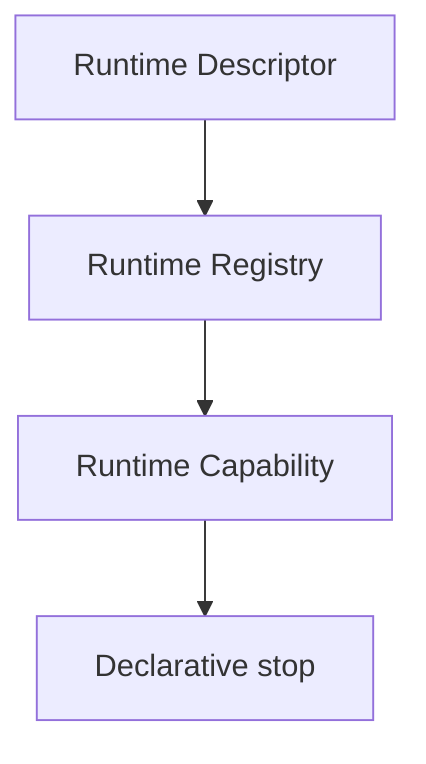

# Runtime Capability RFC

## Purpose and capability model

RuntimeCapability is immutable metadata only describing what a RuntimeDescriptor declares it can support: capability identifier, category, supported features, declared constraints, compatibility references, version compatibility, and deterministic metadata.

## Scope and non-goals

RuntimeCapability is not runtime implementation, not runtime adapter, not runtime execution, not runtime loading, not runtime allocation, not dependency injection, not transport, and not provider dispatch. It has no executable callbacks, provider integration, network, filesystem, process, or side effects.

## Determinism, validation, serialization, and security

Identifiers and versions are explicit. Metadata collections use stable lexical ordering; validation and diagnostics are deterministic. Every result is deeply frozen and JSON-serializable. Capability metadata grants no authorization or execution capability.

## Relationships and extensions

RuntimeCapability relates RuntimeRegistry and RuntimeDescriptor metadata only. A future RuntimeAdapter requires a separate RFC and MUST NOT be inferred from this contract. Extensions MUST remain immutable, explicit, deterministic, serializable, runtime-neutral, transport-neutral, provider-neutral, and metadata only.
