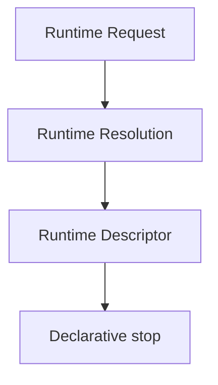

# Runtime Descriptor RFC

## Purpose, scope, and descriptor model

RuntimeDescriptor is immutable metadata only for an eligible runtime. It carries explicit runtime identifier, display name, version, capability references, compatibility references, supported execution classes, declared constraints, lifecycle state, and deterministic metadata ordering.

## Architecture position and non-goals

RuntimeDescriptor follows Runtime Resolution and stays inside the declarative boundary. It is not a runtime implementation, not a runtime adapter, not a runtime instance, not runtime execution, not runtime allocation, not runtime loading, not transport, and not provider dispatch. It has no executable handles, callbacks, functions executing anything, network, filesystem, process, or side effects.

## Determinism, serialization, and security

All identifiers and versions are explicit. Metadata collections use stable lexical ordering; validation and diagnostics are deterministic. Every produced object is deeply frozen and JSON-serializable. Metadata is descriptive only: it grants neither authorization nor execution capability.

## Future relationships and extensions

A future Runtime Registry or Runtime Adapter requires a separate RFC and MUST NOT be inferred from this descriptor. Additive extension points MUST remain immutable, serializable, explicit, deterministic, runtime-neutral, transport-neutral, provider-neutral, and metadata only.
