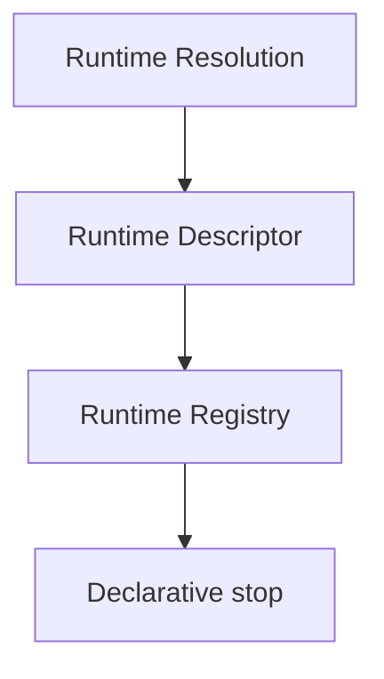

# Runtime Registry RFC

## Purpose and registry model

RuntimeRegistry stores immutable RuntimeDescriptor metadata only: descriptor registration, descriptor lookup semantics, deterministic indexing, version compatibility references, and metadata relationships. It does not contain executable handles, factories, callbacks, loading, dependency injection, or service location.

## Scope and non-goals

RuntimeRegistry is not runtime implementation, not runtime adapter, not runtime loading, not runtime instantiation, not runtime execution, not transport, and not provider dispatch. It remains non-operational and has no side effects.

## Determinism, serialization, and security

Descriptor identifiers are unique and explicit; descriptors and metadata references use stable lexical ordering. Validation, lookup semantics, and diagnostics are deterministic. Every result is deeply frozen and JSON-serializable. The registry grants no authorization or execution capability.

## Future relationships and extensions

RuntimeRegistry depends only on RuntimeDescriptor metadata. A future RuntimeCapability or RuntimeAdapter requires a separate RFC and MUST NOT be inferred from this registry. Extensions MUST remain metadata only, immutable, explicit, deterministic, serializable, runtime-neutral, transport-neutral, and provider-neutral.
