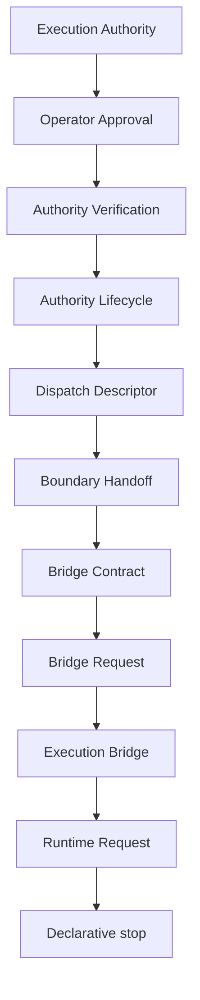

# Runtime Request RFC

## Purpose and scope

RuntimeRequest is the immutable, versioned and serializable declarative request that follows a valid Execution Bridge. It records caller-supplied identifiers, explicit timestamps, the validated Execution Bridge reference, stable evidence references, and optional `RuntimeCapabilityRequirementInput` values. It gives a future runtime layer a bounded contract to consider; it does not make that future layer available.

## Non-goals and operational boundary

RuntimeRequest is **not runtime execution**, **not a runtime adapter**, **not a runtime resolver**, **not transport**, **not a provider**, and **not a dispatcher**. It MUST NOT execute, dispatch, connect, invoke, transmit, schedule, retry, spawn, allocate a runtime, or allocate a provider. It has no side effects and exposes no operational API.

`executionAllowed` remains false and `executionStarted` remains false for every RuntimeRequest result. A constructible request is not authorization, execution authority, or a permit to cross the execution boundary.

## Governance relationships

Execution Bridge remains the sole upstream evidence reference. RuntimeRequest validates its identifier, version, ready state, denied execution flags, and the structure of any capability requirements. It does not evaluate those requirements, select a runtime, or reinterpret governance, approval, eligibility, authority, transport, provider, or agent policy. Runtime Capability requirements are distinct from `AgentCapability` and grant no permission. Future Runtime Resolution and a future Runtime Adapter, if ever introduced, MUST be specified by a separate RFC and MUST NOT be inferred from this contract.

## Validation and deterministic model

Validation is pure and deterministic. A request requires an explicit identifier, version, timestamp, and valid Execution Bridge reference. Diagnostics use stable codes, are sorted deterministically, and contain only safe declarative information. Missing or invalid evidence makes `requestConstructible` false; it never makes a request executable.

The module reads no clock, environment, filesystem, network, process, registry, or mutable global state. All time is explicit input. Evidence references, capability requirements, required features, and accepted constraints are normalized into stable lexical ordering. The capability requirement field remains optional for V13.7 source compatibility, while capability-based selection requires at least one explicit requirement and otherwise fails closed.

## Serialization, security, and extension

Every produced result is deeply frozen and JSON-serializable. Serialization preserves the default-deny flags and does not add payloads, commands, credentials, runtime handles, transport material, or provider material.

The security model is default deny: immutable contracts, explicit identifiers and timestamps, deterministic validation, safe diagnostics, and no operational surface. Future additive fields MAY be introduced only when they remain declarative, versioned, serializable, immutable, runtime-neutral, transport-neutral, and provider-neutral.
