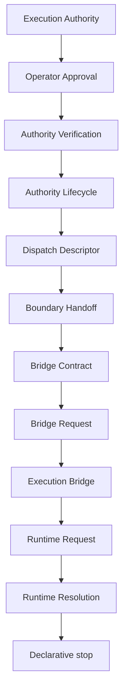

# Runtime Resolution RFC

## Purpose, scope, and terminology

RuntimeResolution is the immutable, versioned, serializable and deterministic contract that maps a valid RuntimeRequest to eligible runtime descriptor metadata. A **resolution** is only the declarative assessment of the supplied request, registry, descriptor, and capability evidence; it never identifies, allocates, creates, or invokes an operational runtime.

## Architecture position and non-goals

RuntimeResolution follows RuntimeRequest and remains inside the declarative boundary. It is **not runtime implementation**, **not a runtime adapter**, **not execution**, **not a dispatcher**, **not transport**, and **not a provider**. It MUST NOT execute, instantiate, allocate, dispatch, invoke, connect, transmit, schedule, retry, or spawn. It provides no operational surface and causes no side effects.

`executionAllowed` remains false and `executionStarted` remains false for every result. An eligible resolution is not authorization, execution authority, dispatch approval, or permission to allocate a runtime.

## Deterministic selection and validation

The original resolution contract evaluates explicit RuntimeRequest evidence and descriptor references. Validation requires an explicit resolution identifier, version, timestamp, and a constructible RuntimeRequest reference with denied execution flags. Descriptor references are normalized into stable lexical ordering. Diagnostics use stable safe codes and are sorted deterministically.

V13.13 adds `selectRuntimeByCapabilities`, a separate pure selection function. It consumes one valid RuntimeRequest, one explicit metadata-only RuntimeRegistry, and one explicit RuntimeCapability catalog. Only descriptors whose lifecycle state is `eligible` participate. Every request requirement must match a referenced declaration; extra declarations are allowed. Compatible descriptor identifiers are sorted lexically and the first identifier is the deterministic tie-break.

Selection does not choose a concrete runtime implementation or return a RuntimeAdapter. It performs no dynamic lookup, registry discovery, scoring heuristic, implicit fallback, clock read, environment read, filesystem access, network access, process access, provider access, or mutable global-state access. Empty requirements, invalid inputs, duplicate capability identifiers, and the absence of a compatible descriptor fail closed with `executionAllowed` and `executionStarted` still false.

## Future relationships, serialization, and extension

A future RuntimeAdapter and a future TransportRequest require separate RFCs and MUST NOT be inferred from RuntimeResolution. This module does not carry adapter payloads, runtime handles, transport payloads, provider material, commands, credentials, or execution instructions.

Every produced object is deeply frozen and JSON-serializable. The default-deny flags survive serialization. Future additive extensions MAY be introduced only when they remain immutable, explicit, deterministic, serializable, runtime-neutral, transport-neutral, provider-neutral, and non-operational.
