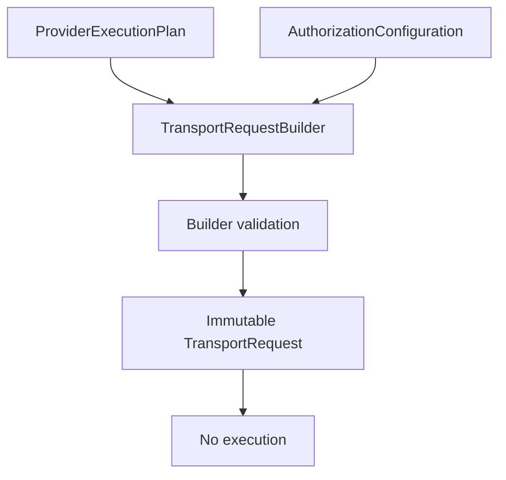

# TransportRequestBuilder V11.2

## Responsibility

`TransportRequestBuilder` is the sole supported factory for producing a
`TransportRequest` from a `ProviderExecutionPlan`.

It accepts exactly two inputs:

- `ProviderExecutionPlan`;
- `AuthorizationConfiguration`.

It returns a `TransportRequestBuilderResult` containing either an immutable
`TransportRequest` or a structured deterministic error. It does not accept a
Runtime instance, Transport instance, Provider implementation, filesystem
handle, process option, or external configuration source.

## Lifecycle

The builder is still before the execution boundary defined by the V11 RFC.
Producing a `TransportRequest` is not dispatch. A built request remains
inactive, not dispatchable, not executable, and validation-required.

As of V11.3, a built request must pass through `ExecutionReviewGate` before any
future handoff can be considered. The reviewed request remains non-approved,
non-dispatchable, and non-executable. See
`docs/architecture/execution-review-gate.md`.

## Invariants

The builder MUST:

- copy validated references from the plan and authorization configuration;
- normalize bounded metadata deterministically;
- verify provider, mapping, intent, runtime, transport, capability, and
  authorization references;
- return frozen output;
- set `executionStarted: false`.

The builder MUST NOT:

- create a `TransportAdapterRequest`;
- call a Runtime;
- call a Transport;
- call a Provider;
- create commands or arguments;
- reference executable paths or binary paths;
- read environment variables;
- touch filesystem or network APIs;
- import process APIs.

## Normalization

Metadata normalization is additive and bounded. The builder preserves provider
plan metadata, adds the authorization configuration identity, and records review
metadata as data. It does not infer credentials, process configuration,
timeouts, command lines, or runtime fields.

The request identifier is deterministic. If existing metadata provides
`transportRequestId` or `requestId`, the builder uses that value. Otherwise it
derives a stable local identifier from the provider and authorization
configuration identities.

## Validation

Validation is deterministic and stops at the first failing gate:

- invalid provider plan;
- invalid authorization;
- invalid mapping reference;
- invalid intent reference;
- invalid runtime reference;
- invalid transport reference;
- invalid capability reference.

Every failure returns a stable `TransportRequestBuilderError` with
`executionStarted: false`.

## Immutability

The builder freezes the request and all nested reference objects. Callers cannot
mutate a built request to widen authority after validation.

## Sole factory

`TransportRequest` has no direct provider-plan constructor outside the builder.
Core exposes the builder through `buildTransportRequest()` and related
validation, summary, and normalization helpers. Future execution work MUST use
this factory before any reviewed handoff design can be considered.
