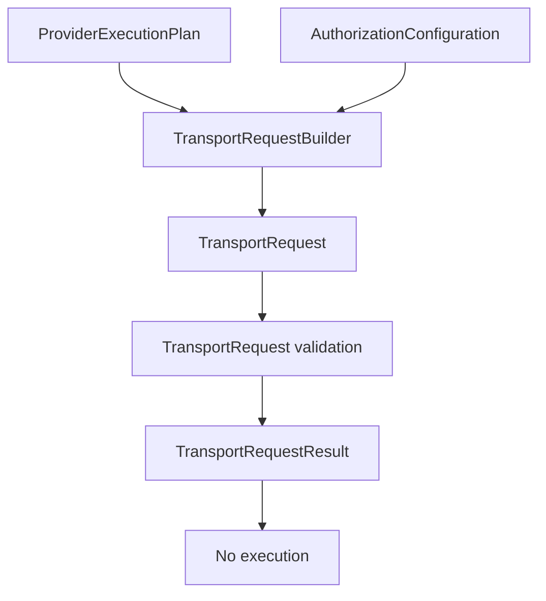

# TransportRequest V11.1

## Responsibility

`TransportRequest` is the declarative handoff contract introduced after the
V11 execution RFC. It records which validated references would need to
participate in a future execution handoff:

- provider;
- executable mapping;
- authorization configuration;
- runtime;
- transport;
- capability references;
- policy reference.

The contract is immutable and default-deny. It is not a transport payload and
does not grant authority to execute.

## Lifecycle

The lifecycle remains declarative:

`TransportRequest` sits after authorization evidence and before any future
transport boundary. V11.1 stops at validation. It does not dispatch to a
`TransportAdapter`, does not call a Runtime, and does not create a backend
operation.

As of V11.2, `TransportRequestBuilder` is the sole supported factory for
creating a `TransportRequest` from a `ProviderExecutionPlan`. See
`docs/architecture/transport-request-builder.md`.

## References

The request contains references only:

- `providerId` and `provider`;
- `mapping.mappingId`;
- `authorization.configurationId`;
- `runtime.runtimeId`;
- `transport.transportId`;
- `capabilities[].capabilityId`;
- `policy.policyId`.

These fields make the future handoff auditable without representing how
execution would happen.

## Security model

The request is always:

- inactive;
- not dispatchable;
- not executable;
- validation required.

It MUST NOT contain commands, arguments, environment variables, working
directories, binary paths, standard I/O, process options, credentials, network
configuration, filesystem discovery, or timeout values.

Validation checks references in a deterministic order and returns structured
errors with `executionStarted: false`. A valid set of references still does not
cross the execution boundary.

## Why it remains non executable

The V11 RFC defines execution as the future Core-owned imperative handoff to a
selected `TransportAdapter` after validated evidence and explicit human
approval. V11.1 intentionally implements only the immutable contract layer.

This keeps protocol validation, executable mapping, authorization evidence, and
transport execution separate. A later reviewed lot may decide how a validated
request is handed to a transport, but this document and contract introduce no
execution capability.
