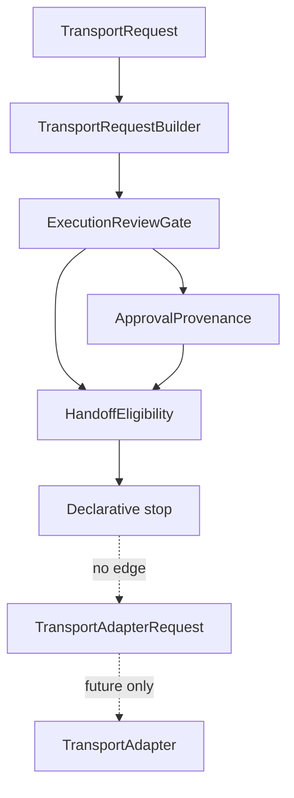

# V11 Consolidation

V11.6 consolidates the declarative review architecture introduced across
V11.1 through V11.5. It introduces no new business concept, execution concept,
transport concept, CLI surface, JSON contract, or report contract.

The consolidation keeps the existing responsibilities intact and extracts only
shared technical helpers for immutable values, metadata reads, version
compatibility checks, validation envelopes, diagnostics, and summary counts.

## Responsibility matrix

| Layer                        | Responsibility                                                                                             | Must not own                                                        |
| ---------------------------- | ---------------------------------------------------------------------------------------------------------- | ------------------------------------------------------------------- |
| `TransportRequest`           | Declarative references from authorization toward a future transport boundary.                              | Runtime calls, Transport calls, commands, adapter payloads.         |
| `TransportRequestBuilder`    | The sole factory from `ProviderExecutionPlan` and `AuthorizationConfiguration` to `TransportRequest`.      | Runtime selection, Transport interaction, adapter request creation. |
| `ExecutionReviewGate`        | Declarative review of a `TransportRequest` against authorization configuration.                            | Approval identity, execution permission, dispatch.                  |
| `ApprovalProvenance`         | Evidence describing the reviewed request, scope, abstract approval identifiers, and reviewed versions.     | Authorization, identity systems, signatures, handoff.               |
| `HandoffEligibility`         | Declarative consistency assessment between reviewed request and approval provenance.                       | Authorization, handoff, dispatch, execution.                        |
| `review-architecture/shared` | Technical helpers for immutable contracts, metadata, diagnostics, validation envelopes, and stable counts. | Domain decisions, policy, runtime, transport, provider behavior.    |

## Dependency matrix

| Module                              | May depend on                                                                                      | Must not depend on                                                                                      |
| ----------------------------------- | -------------------------------------------------------------------------------------------------- | ------------------------------------------------------------------------------------------------------- |
| `src/transport-request/`            | Provider plan contracts, authorization contracts, shared review helpers.                           | CLI, LoopRunner, Runtime implementations, Transport implementations.                                    |
| `src/review/`                       | `TransportRequest`, authorization contracts, shared review helpers.                                | CLI, LoopRunner, Runtime implementations, Transport implementations.                                    |
| `src/provenance/`                   | `ReviewedTransportRequest`, authorization contracts, RFC version constants, shared review helpers. | Runtime implementations, Transport implementations, Provider implementations.                           |
| `src/handoff-eligibility/`          | `ReviewedTransportRequest`, `ApprovalProvenance`, RFC version constants, shared review helpers.    | Runtime implementations, Transport implementations, Provider implementations, adapter request builders. |
| `src/review-architecture/shared.ts` | TypeScript primitives only.                                                                        | Domain modules, CLI, LoopRunner, Runtime, Transport, Provider, process, filesystem, network.            |

## Validation matrix

| Validation                   | Input                                                                          | Output                              | Boundary              |
| ---------------------------- | ------------------------------------------------------------------------------ | ----------------------------------- | --------------------- |
| Transport request validation | `TransportRequest`                                                             | `TransportRequestResult`            | Declarative stop.     |
| Builder validation           | `ProviderExecutionPlan`, `AuthorizationConfiguration`                          | `TransportRequestBuilderValidation` | Declarative stop.     |
| Review validation            | `TransportRequest`, `AuthorizationConfiguration`                               | `ExecutionReviewValidation`         | Declarative stop.     |
| Provenance validation        | `ApprovalProvenance`, `ReviewedTransportRequest`, `AuthorizationConfiguration` | `ApprovalValidation`                | Evidence-only stop.   |
| Eligibility validation       | `ReviewedTransportRequest`, `ApprovalProvenance`                               | `HandoffEligibilityValidation`      | Assessment-only stop. |

Every validation remains deterministic, side-effect free, and default-deny.
Validation failures report safe diagnostics with `executionStarted: false`.

## Ownership matrix

| Concern                            | Owner                                                                    |
| ---------------------------------- | ------------------------------------------------------------------------ |
| Immutable object freezing          | `src/review-architecture/shared.ts`                                      |
| Metadata string reads              | `src/review-architecture/shared.ts`                                      |
| Version metadata compatibility     | `src/review-architecture/shared.ts`                                      |
| Validation envelope shape          | Domain module, backed by shared helpers.                                 |
| Domain-specific error codes        | Domain module.                                                           |
| Domain-specific summaries          | Domain module, backed by shared helpers when counting repeated outcomes. |
| Approval and eligibility decisions | Their existing domain modules only.                                      |

## Security boundary

V11.6 does not move the security boundary. All reviewed evidence remains
declarative. The shared helper module is intentionally unable to execute
anything because it imports no Runtime, Transport, Provider, filesystem,
network, process, or CLI modules.

The consolidation preserves:

- default deny;
- no inferred approval;
- no inferred eligibility;
- no `TransportAdapterRequest` creation;
- no `RuntimeRequest` creation;
- no dispatch;
- no execution;
- no process API;
- no filesystem API;
- no network API;
- no `process.env` access.

## Execution boundary

The execution boundary remains exactly where the V11 RFC defines it: a future
Core-owned operation may explicitly hand approved evidence to a selected
`TransportAdapter`. No V11.6 helper, validator, summary, error factory, or
metadata utility crosses that boundary.

## Review boundary

Review remains distinct from approval provenance and handoff eligibility.
Review validates a request against configuration. Provenance records evidence
about what was reviewed. Eligibility evaluates consistency between existing
reviewed evidence and provenance.

Eligibility is still not authorization, not handoff, and not execution.

## Consolidated helpers

`src/review-architecture/shared.ts` centralizes duplicated technical mechanics:

- `freezeReviewArchitectureValue`;
- `readReviewArchitectureMetadataString`;
- `reviewArchitectureMetadataVersionCompatible`;
- `reviewArchitectureMetadataVersionMismatch`;
- `countReviewArchitectureItems`;
- `createReviewArchitectureError`;
- `diagnosticFromReviewArchitectureError`;
- `createReviewArchitectureValidation`.

The helper names are intentionally technical. They do not create a new product
or execution layer.
